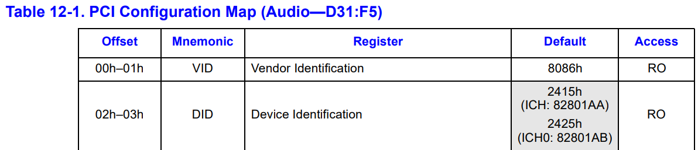
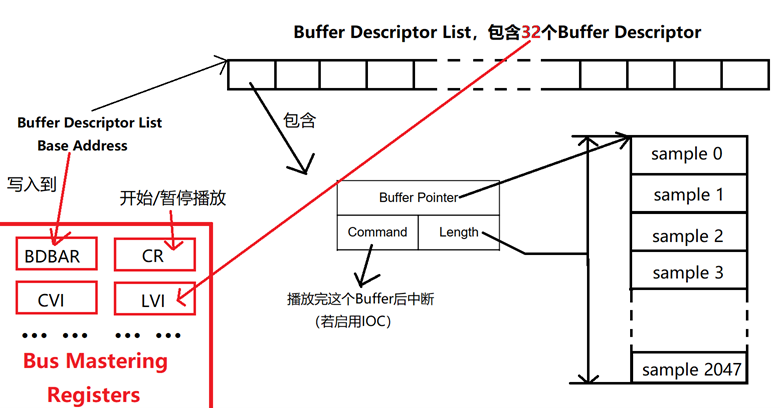
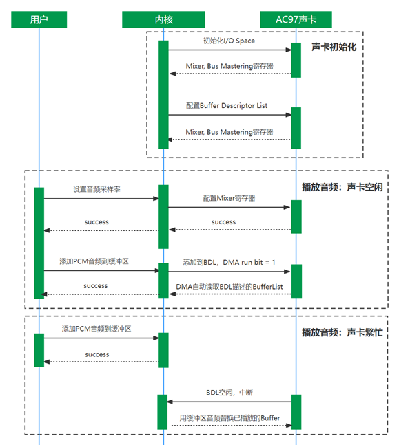

# OS 大作业攻略——如何在 xv6 中实现音频播放

> 软件 03 和嘉晅
>
> jx-he19@mails.tsinghua.edu.cn

这篇文章将介绍如何一步步在原版[xv6-riscv](https://github.com/mit-pdos/xv6-riscv)上添加音频播放功能。（代码参见[OS2022-MP3/xv6-mp3 (github.com)](https://github.com/OS2022-MP3/xv6-mp3)）

## 配置运行环境

按照[xv6 官网上的安装攻略](https://pdos.csail.mit.edu/6.828/2021/tools.html)，可以在 Ubuntu 中输入以下命令配置运行环境：

```shell
sudo apt-get update && sudo apt-get upgrade
sudo apt-get install git build-essential gdb-multiarch qemu-system-misc gcc-riscv64-linux-gnu binutils-riscv64-linux-gnu
```

然后在 xv6-risc-v 根目录下输入`make qemu`运行。然后可以输入`CTRL+a`，再输入`x`退出 xv6。

### 陷阱 1：是否使用 Windows Subsystem for Linux（WSL）

一般来说，xv6-riscv 是可以在[WSL](Windows Subsystem for Linux)上正常运行的。然而，WSL 并不支持播放声音，你需要[手动配置音频转发](https://blog.sandtears.com/2020/02/27/wsl-gui-audio-support.html#%E4%B8%BAWSL%E8%AE%BE%E7%BD%AE%E9%9F%B3%E9%A2%91%E8%BD%AC%E5%8F%91)才能在 WSL 中播放声音。

因此如果你是 Windows 用户，并且你的选题中需要与具体的硬件设备交互时（比如实现网卡驱动、声卡驱动、VGA 驱动），最好是使用 VMWare 或者 VirtualBox 构建一个 Ubuntu 虚拟机，在这个虚拟机上运行 xv6。

> 建议使用 VMWare，因为 VMWare 在安装时会自动检测你的电脑是否开启 Hyper-V，如果开启则会提醒你自动安装 Windows Hypervisor Platform (WHP)。而 VirtualBox 则需要你手动安装 WHP，否则不能正常运行。

### 陷阱 2：Ubuntu 版本

如果你按照[xv6 官网上的安装攻略](https://pdos.csail.mit.edu/6.828/2021/tools.html)安装了 Ubuntu 20.04，你会发现通过 apt-get 安装的 QEMU 版本只有`4.2.1`，经测试，在这个版本的`qemu-system-riscv64`上通过 AC97 声卡播放音频会发生未知错误。

你当然可以下载最新版的 QEMU 源码，然后手动编译。但更简单的方式是升级 Ubuntu 到 22.04，这样通过 apt-get 安装的 QEMU 版本为`6.2.0`，可以正常驱动 AC97 声卡播放音频。

## 编写声卡驱动

### 前置：确定具体硬件标准

> xv6 并非直接运行你的系统上，而是运行在由 QEMU 模拟的一系列虚拟硬件（包括主板、CPU、硬盘等）构成的虚拟机器上。（如果你是在 Ubuntu 虚拟机中运行的 xv6，那么 xv6 是运行在 Ubuntu 虚拟机中的 QEMU 虚拟机上）
>
> 因此你需要让 QEMU 模拟响应的硬件，才能编写相应的驱动，使用这个硬件。

输入`qemu-system-riscv64 -device help`，打印 xv6 支持模拟的虚拟硬件列表。这里截取部分输出：

```shell
... ...
Network devices:
name "e1000", bus PCI, alias "e1000-82540em", desc "Intel Gigabit Ethernet"
name "e1000-82544gc", bus PCI, desc "Intel Gigabit Ethernet"
name "e1000-82545em", bus PCI, desc "Intel Gigabit Ethernet"
name "e1000e", bus PCI, desc "Intel 82574L GbE Controller"
name "i82550", bus PCI, desc "Intel i82550 Ethernet"
name "i82551", bus PCI, desc "Intel i82551 Ethernet"
... ...
Sound devices:
name "AC97", bus PCI, alias "ac97", desc "Intel 82801AA AC97 Audio"
name "ES1370", bus PCI, alias "es1370", desc "ENSONIQ AudioPCI ES1370"
name "hda-duplex", bus HDA, desc "HDA Audio Codec, duplex (line-out, line-in)"
name "hda-micro", bus HDA, desc "HDA Audio Codec, duplex (speaker, microphone)"
name "hda-output", bus HDA, desc "HDA Audio Codec, output-only (line-out)"
name "ich9-intel-hda", bus PCI, desc "Intel HD Audio Controller (ich9)"
name "intel-hda", bus PCI, desc "Intel HD Audio Controller (ich6)"
name "usb-audio", bus usb-bus
... ...
```

可以看到 QEMU 支持模拟许多种常见的声卡标准，包括：AC97，ES1370，ich6，ich9。

> 可以先在[OSDev Wiki](https://wiki.osdev.org/)上查询这些声卡标准，寻找功能较多或是驱动实现简单的声卡

这里我们选择驱动实现较简单的 AC97 声卡。修改`Makefile`，在 QEMU 中添加 AC97 虚拟声卡：

```makefile
# 在 QEMUOPTS = -machine virt -bios none -kernel $K/kernel -m 256M -smp $(CPUS) -nographic 后添加这2句
QEMUOPTS += -audiodev id=pa,driver=alsa # 音频后端，告诉QEMU使用什么后端模拟虚拟声卡
QEMUOPTS += -device AC97,audiodev=pa    # 虚拟声卡
```

### 前置：查阅文档

文档在编写硬件驱动的过程中至关重要

- 建议先[OSDev Wiki](https://wiki.osdev.org/)上的页面（例如[AC97](https://wiki.osdev.org/AC97)），相比于动辄几百页的官方文档，这个页面上的内容能让你对编写硬件驱动有一个整体认知
- 然后在网上搜索硬件官方文档，关键字为硬件标准名称 + `Datasheet`、`Reference Manual`、`Programmer's Reference Manual`
  - 注意使用尽量具体的型号搜索硬件文档，例如 QEMU 对 AC97 的描述`name "AC97", bus PCI, alias "ac97", desc "Intel 82801AA AC97 Audio"`中标注了具体的硬件型号为`Intel 82801AA AC97`

### 在 PCI Configuration Space 上定位硬件

参考[xv6-labs-2021](https://github.com/mit-pdos/xv6-riscv-fall19)的 net 分支中`kernel/pci.c`的方式（[地址](https://github.com/mit-pdos/xv6-riscv-fall19/blob/net/kernel/pci.c)，请配合这份代码继续阅读），通过`VID`与`DID`在 PCI Configuration Space 上定位硬件。查询 82801AA Datasheet 中关于 82801AA 的 PCI Configuration Space 的定义：



由于我们选择的设备是 82801AA，可以用`VID=8086h`（注意是 16 进制！）和`DID=2425h`这两个条件定位 AC97 在 PCI Configuration Space 上的位置。

### 声卡初始化

阅读文档，正确配置 PCI Configuration Space 上的`NAMBAR`与`NABMBAR`寄存器来初始化 I/O Space 上的 Native Audio Mixer Base Address 与 Native Audio Bus Mastering Base Address。

> 参考：
>
> - OSDev Wiki 中对 AC97 初始化过程的描述
> - [xv6-labs-2021](https://github.com/mit-pdos/xv6-riscv-fall19)的 net 分支中`kernel/pci.c`
> - 官方文档对`NAMBAR`与`NABMBAR`寄存器的逐位定义

现在我们需要操作定义在 I/O Space 上的 Native Audio Mixer Base Address 与 Native Audio Bus Mastering Base Address，完成一系列初始化操作，包括 RESET 以及配置 Codec，具体参考 AC ’97 Programmer’s Reference Manual 以及在 xv6-x86 上实现的 AC97 声卡驱动[zhaoyuhang/THSS14-XV6 (github.com)](https://github.com/zhaoyuhang/THSS14-XV6)。

#### 如何在 RISC-V 上与 I/O Space 交互？

x86 指令集中提供了`IN,OUT`指令与 I/O Space 中的指定端口交互，但 RISC-V 中不存在类似的指令。

为此我们需要深入 xv6-riscv 使用的虚拟主板来寻找答案：查看`Makefile`得知，xv6-riscv 中使用的主板模型为[virt](https://www.qemu.org/docs/master/system/riscv/virt.html)。尽管该主板缺乏相关文档，我们可以从它的[源码](https://github.com/qemu/qemu/blob/master/hw/riscv/virt.c)中发现一个线索：

```c
... ...
static const MemMapEntry virt_memmap[] = {
    [VIRT_DEBUG] =        {        0x0,         0x100 },
    [VIRT_MROM] =         {     0x1000,        0xf000 },
    [VIRT_TEST] =         {   0x100000,        0x1000 },
    [VIRT_RTC] =          {   0x101000,        0x1000 },
    [VIRT_CLINT] =        {  0x2000000,       0x10000 },
    [VIRT_ACLINT_SSWI] =  {  0x2F00000,        0x4000 },
    [VIRT_PCIE_PIO] =     {  0x3000000,       0x10000 },
    [VIRT_PLATFORM_BUS] = {  0x4000000,     0x2000000 },
    [VIRT_PLIC] =         {  0xc000000, VIRT_PLIC_SIZE(VIRT_CPUS_MAX * 2) },
    [VIRT_APLIC_M] =      {  0xc000000, APLIC_SIZE(VIRT_CPUS_MAX) },
    [VIRT_APLIC_S] =      {  0xd000000, APLIC_SIZE(VIRT_CPUS_MAX) },
    [VIRT_UART0] =        { 0x10000000,         0x100 },
    [VIRT_VIRTIO] =       { 0x10001000,        0x1000 },
    [VIRT_FW_CFG] =       { 0x10100000,          0x18 },
    [VIRT_FLASH] =        { 0x20000000,     0x4000000 },
    [VIRT_IMSIC_M] =      { 0x24000000, VIRT_IMSIC_MAX_SIZE },
    [VIRT_IMSIC_S] =      { 0x28000000, VIRT_IMSIC_MAX_SIZE },
    [VIRT_PCIE_ECAM] =    { 0x30000000,    0x10000000 },
    [VIRT_PCIE_MMIO] =    { 0x40000000,    0x40000000 },
    [VIRT_DRAM] =         { 0x80000000,           0x0 },
};

```

原来 VirtIO 主板将 I/O Space 映射到了`VIRT_PCIE_PIO`这段内容上，因此所有与 I/O Space 的交互都可以通过直接读写内容实现。（参见[xv6-mp3/ac97.c at master · OS2022-MP3/xv6-mp3 (github.com)](https://github.com/OS2022-MP3/xv6-mp3/blob/master/kernel/ac97.c)）

### 配置 DMA 引擎

DMA（Direct memory access）引擎允许硬件通过直接读取内容的方式传输数据。我们只需要通过控制寄存器告诉硬件：

- 数据放在那里（地址）
- 有多少数据（长度）

这样硬件就可以绕开缓慢的 I/O，直接从内容读取数据。具体在 AC97 声卡驱动中，首先需要在内存中设置一个 Buffer Descriptor List，包含若干个 Buffer Descriptor，每个 Buffer Descriptor 通过起始地址和长度描述了一段存储 PCM 格式音频数据的 Buffer，如下图所示：



Buffer, Buffer Descriptor 的定义，音频传输的具体格式，以及`BDBAR`, `CR`, `CVI`, `LVI`等控制寄存器的逐位解释，请参考官方文档。

### 配置硬件中断

最后，还需要配置 plic，让 AC97 的中断可以传递给 CPU，并修改设备相关的中断处理程序，将中断分发给驱动程序。这样驱动程序可以在缓冲区中的音频播放完后，载入新的音频数据。（请参考[xv6-labs-2021](https://github.com/mit-pdos/xv6-riscv-fall19)的 net 分支中的`kernel/plic.c`与`kernel/trap.c`中对`devintr`函数的修改）

## 编写内核 I/O 软件

内核 I/O 软件需要你发挥自己的聪明才智，设计合理的机制，让用户可以通过系统调用播放音频。这里给出一种可能的实现（有很大的改进空间 →_→）：



你可能还会遇到以下两个问题：

### 如何添加系统调用？

> 请先阅读[xv6-book](https://pdos.csail.mit.edu/6.S081/2020/xv6/book-riscv-rev1.pdf)的第一章与第二章

添加系统调用是一件非常琐碎但并不困难的事。这里以添加查询剩余内存的系统调用`freem`为例：

1. 在`kernel/syscall.h`中添加新的系统调用代码：

```c++
... ...
#define SYS_unlink 18
#define SYS_link   19
#define SYS_mkdir  20
#define SYS_close  21
// new system call
#define SYS_freem  22
```

2. 在`kernel/syscall.c`中更新`syscalls`表，为对应的系统调用代码添加处理函数`sys_freem`。

```c++
extern uint64 sys_freem(void);

static uint64 (*syscalls[])(void) = {
[SYS_fork]    sys_fork,
... ...
[SYS_close]   sys_close,
[SYS_freem]   sys_freem // new system call
};
// syscalls[SYS_freem] = sys_freem
```

3. 在`kernel/sysproc.c`中定义`sys_freem`，调用`freem`

```c++
uint64
sys_freem(void)
{
  return freem();
}
```

4. 实现`freem`

获取空闲内存需要遍历 memory allocator 的`freelist`，因此将`freem`定义在`kernel/kalloc.c`中：

```c++
uint64
freem(void)
{
  int count = 0;
  acquire(&kmem.lock);
  for (struct run *r = kmem.freelist; r; r=r->next)
    count++;
  release(&kmem.lock);
  return count * 4096;
}
```

同时需要修改`kernel/defs.h`：

```c++
// kalloc.c
void*           kalloc(void);
void            kfree(void *);
void            kinit(void);
uint64          freem(void); // new system call
```

5. 在用户空间编写系统调用的机器指令

为了在用户空间中调用，需要修改`user/usys.pl`，补上用`ecall`调用`freem`的代码。

```perl
#!/usr/bin/perl -w

# Generate usys.S, the stubs for syscalls.

print "# generated by usys.pl - do not edit\n";

print "#include \"kernel/syscall.h\"\n";

sub entry {
    my $name = shift;
    print ".global $name\n";
    print "${name}:\n";
    print " li a7, SYS_${name}\n";
    print " ecall\n";
    print " ret\n";
}

entry("fork");
... ...
entry("uptime");
# new system call
entry("freem");
```

同时需要修改`user/user.h`，添加新的系统调用：

```c++
// system calls
int fork(void);
... ...
int uptime(void);
int freem(void);
```

6. 在用户空间调用

定义用户程序`user/free.c`：

```c++
#include "kernel/types.h"
#include "user/user.h"

int
main(int argc, char *argv[])
{
  printf("free mem: %d bytes\n", freem());
  exit(0);
}
```

将`free`加入`Makefile`：

```c++
# Custom User Program
UPROGS += $U/_free
```

运行结果如下：

```
$ free
free mem: 133390336 bytes
```

### 如何将用户空间的数据拷贝到内核空间？

使用`either_copyin`函数（请参考原版 xv6`kernel/console.c`中的使用方法，或是`kernel/proc.c`中的定义）

## 用户空间音频解码

实现音频播放的系统调用后，只需要在用户空间编写音频的解码程序，即可播放音频。

- 对于 WAV 格式的音频，直接将 PCM 数据通过系统调用送给声卡
- 其它格式的音频需要解码算法将原始数据转换为 PCM 数据，这里给出相关开源仓库以供参考
  - [lieff/minimp3: Minimalistic MP3 decoder single header library (github.com)](https://github.com/lieff/minimp3)
  - [jprjr/miniflac: Single-file FLAC decoder with a push-style API (github.com)](https://github.com/jprjr/miniflac)

你可能还会遇到以下两个问题：

### 栈空间大小不足以运行解码程序

解码进程可能需要较大的栈空间。尽管可以用 sbrk 系统调用增加进程内存，但栈空间却是固定的 4096B（一个页的大小）。

一种简单粗暴的方式是直接修改`kernel/exec.c`中将程序装载到内的过程，给栈空间分配了 10 个页。读者可以构思更优雅的实现方式。

### 音频文件太大，mkfs 生成虚拟硬盘镜像失败

由于 xv6 采用一级索引的存储管理方式储存文件，且块大小固定为 1024B，这就导致文件大小的上限很小，甚至不足以支持存储很短的音频文件。

一种方法是将一级索引拓展为二级索引或三级索引（参考[Lab: file system (mit.edu)](https://pdos.csail.mit.edu/6.S081/2020/labs/fs.html)）

另一种简单粗暴的方式是直接修改参数，扩大块大小。（会降低空间利用率！！）

以上就是这篇攻略的全部内容了( •̀ ω •́ )y。感谢看到这里的你！如果有问题，请联系jx-he19@mails.tsinghua.edu.cn。
