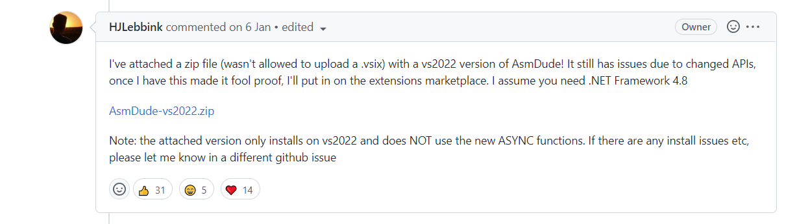
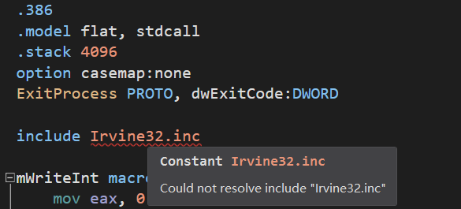
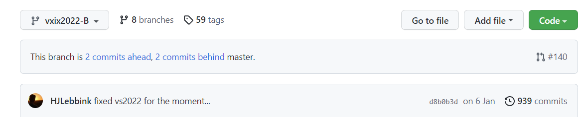
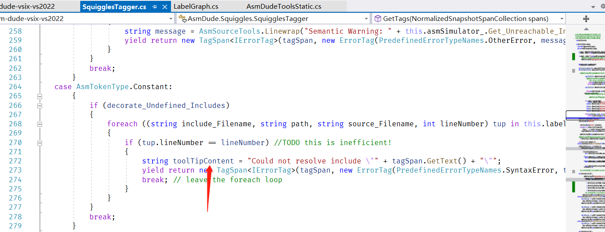
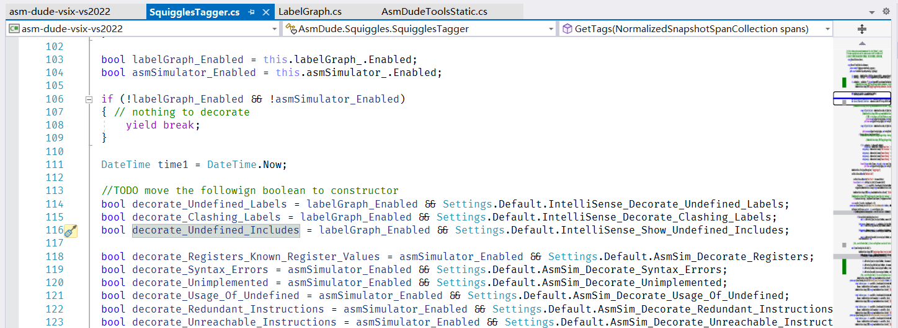
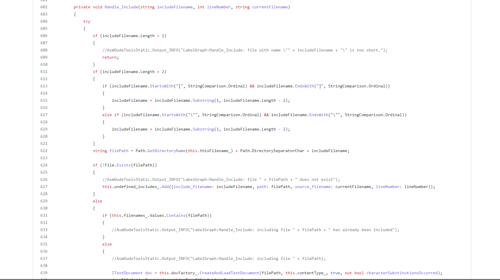
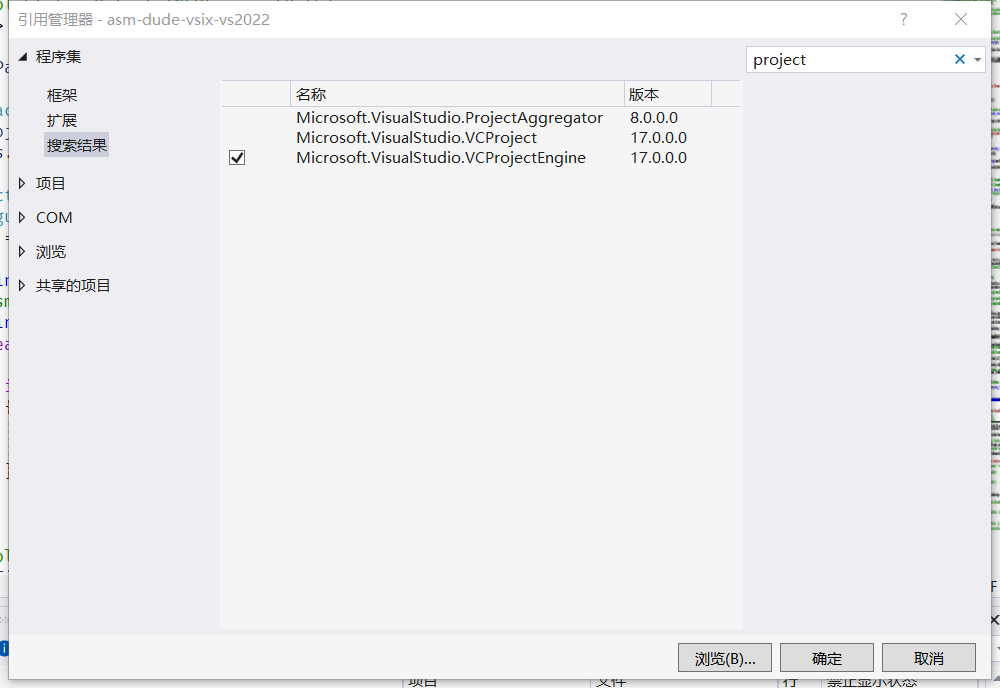
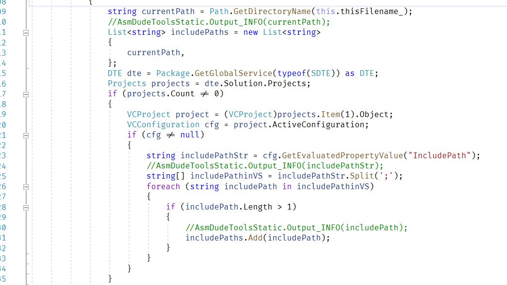
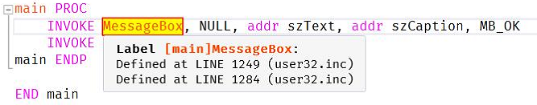

# VS2022配置汇编高亮

> 作者：董文冲

汇编与编译原理课程的课前公告里指导了如何配置 Visual Studio 环境，其中提到了语法高亮需要选用插件。课程提供了 Asm Highlighter，但在 vs2022 上无法使用，于是考虑使用其他插件；进行一番搜索后，发现在 Asm Dude 在 GitHub 的 repo 下的一个关于新版本支持的 issue 里有作者发布的一个 vs2022 beta 版插件，这个插件可以正常使用。

然而，这个插件并非那么完美，它只能解析与项目文件在同一位置的 include 的文件，否则会报 warning，认为找不到文件；然而，这些文件是被正常地涵盖进 includepath 的，编译器知道在哪里调用它们。于是我考虑自行修改这个插件，让它支持解析环境变量配置中的 includepath。

根据作者发表回复的时间和 branch 更新的时间，定位到原作者是在 vxix2022-B 分支上编译的这个插件，当然我们都知道 vs 插件的格式是 vsix，大概是笔误了吧。

我们都知道 vs 系的东西都是 csharp 开发的，所以我们可以很快地定位到 VS/CSHARP，之后打开 asm-dude-vsix-2022 下的 csproj 文件，根据 include 报错的 message，在项目里搜索 Could not resolve include… 发现它是由 decorate_Undefined_Includes 控制的。再往上溯源可以溯源到一个这个变量的定义。

表达式的后半部分是IntelliSense的支持，和我们要处理的无关。前半部分不断 forward 可以推测出 labelGraph_Enabled 实际上是读取自 `this.labelGraph_.Enabled`，labelGraph_ 是一个 LabelGraph 类的变量。由此我们定位到 LabelGraph 类。之前的 switch case 的 case value 是 AsmTokenType.Constant，先尝试在 LabelGraph 的实现中找 Constant 关键字，然而没有结果。索性直接去找 include。

大概在这里很快找到在构建 labelgraph 过程中，对于 include 关键字的处理。如果存在形如“include xxx”的内容，会触发 Handle_Include 这个成员函数。这里截了 GitHub 的图，因为我自己的代码已经改过了（）

整个 Handle_Include 的逻辑是比较好理解的。它简单对 filename 进行了有效性的判断，移去了一些有关 [] 和 \ 的无关字符。接着利用当前文件的目录，和参数里的 filename 构造了 filepath。当 filepath 存在时，将这个文件整个读进来。在这里，可以看到在造filepath的时候是使用了当前文件的目录，原作者没有将用户设定的 include paths 中的其余 path 给 include 进来。

搜索 visual studio 插件如何获取环境，得到一些微软深度耦合的文档，大致意思是通过一个名为 dte 的东西获取开发环境，代码大致如下：

之后可以通过 `projects.Item(1)` 获取当前的环境，之后通过其 `ConfigurationManager` 获取 `ActiveConfiguration`。但发现试图读取这个配置的信息的时候总是报错，继而发现其值为 null，但死活找不出原因。在一通搜索后得到一个很令我震撼的答案：对于汇编项目之类的 C++ 项目，其项目的 interface 为 VCProject，而不是 Project；其配置类型为 VCConfiguration，而不是 Configuration。由于接口不一致，所以就是无法如此获得其配置信息。把 VCProject 相关的 dll 加入项目引用中：

完整修改的代码大致如下：

将原本的 check 单个路径下文件，修改为 check 一遍在 include paths 中，文件是否在某一个 path 中存在。在修改 flag 的同时，更新 filepath，保证它之后能够按照原有的逻辑，顺利地把 include 文件读进来并解析相关定义。

期间，使用 Visual Studio 自带的调试附加即可调试插件。在调试环境中指定外部程序 devenv，即可启动 vs 实例进行插件调试。

GetEvaluatedPropertyValue 函数用于处理带宏的变量，可以将宏展开为实际值。这里的 IncludePath 为整个项目的 include，而不只是 Masm 的；但考虑到 Masm 的 include 也继承自 IncludePath，所以只需要将之前环境配置中的 include 挪到整个项目即可。也考虑过去读 Masm Assembler 里的 include paths，但是不太成功，找不到相关信息说该读取哪个环境变量，就这么凑合用了。

最后结果：

正确解析了 include file，可喜可贺，可喜可贺。
