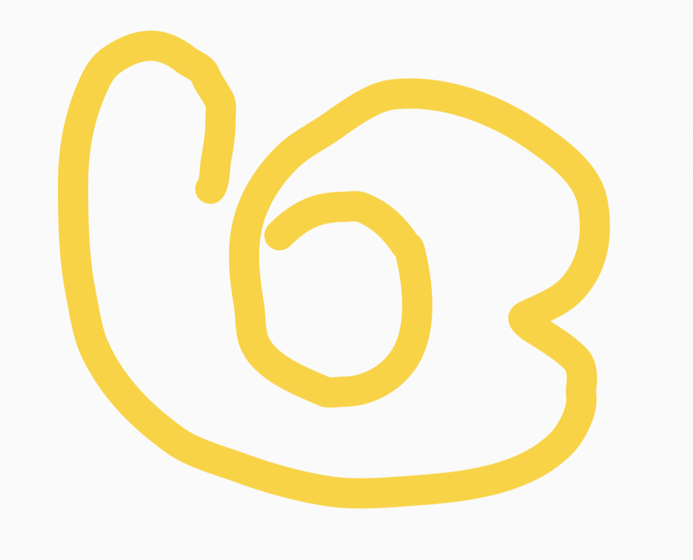

## 书信-1

中学的时候，同班同学会一起上三年时间的课，而大学每个人的课表都不相同，基本是同班的同学，也只有几门课时一起上而已，班上的活动也不多，但是相对而言就会有更多的时间和机会可以认识不同的人，也有或更多的时间去做自己想做的事。  

大学时期的生活相比于中学时期的生活，节奏快了不少。比起中学生活，大学生活自由很多，这样的生活有利也有弊，获得自由的同时，相对的也失去了一些以前有的东西，因此自律、独立、个人能力以及适应能力等都非常重要。

最重要的可能是理想和目标。大学不像中学，不会在有老师督促我们学习和努力。有了理想和目标，才会有努力和改变的动力，能力可以提升，理想更可贵。中学时期，我们的目标可能是学习或者竞赛，能考上一个好的大学，但是大学之后每个人的人生目标开始不同，有的想要继续读研究生，有的像专心做学术，有的像到好的公司上班，有的则是想创业等等。不同的理想和目标，努力的方向也是不同的。

或许在找到理想和目标前，会感到迷茫没有方向，但是人生或许就是这样，理想会随着人生的经历不停地在改变，更重要的是在这个过程中，也在逐渐的成长。人生的过程很多时候反而是更重要的，在别人眼中结果或许更重要，但是对于自己而言我相信过程永远都应该要大于结果。

希望你们在充满机遇和挑战的大学生活中，享受每一时每一刻，用青春的热血和智慧，点燃心中的理想，脚踏实地，刻苦努力，书写无悔青春，谱就精彩人生。

## 书信-2

很开心你能读到我写的信~

作为清华园中一个心态良好的普通人，我认为到了清华，大一在稳住成 绩的同时(确实要稳住成绩，不过这就很难了QAQ)，要多多体验清华的学 生生活，千万不要为了卷而卷呐，卷无止境呐qwq

可以参与一些学生工作，服务同学的同时最能体会到组织活动的成就与 收获;可以参加一些学生社团，这也是培养你大学期间兴趣爱好的最佳途径 (还能认识许多在软院认识不到的xjj);反正就是要多多利用学校给咱们提 供的各种资源，不光是学习，努力让自己在学习的重压中过得快乐，不必追 求尽善尽美，力求在学校过的舒心qwq。

哎鸭想说挺多的但是信里面又不知道写点啥，如果在未来的生活里有什 么问题，非常欢迎来找学长学姐辅导员们排解，他们都是你最好的朋友，最 后在下面画朵小花敷衍一下把(x

祝过出自己的清华生活~

## 书信-3

生活再忙，也要去看看星星，赏赏月亮。因为它们，往往能予人以不竭的动 力与不灭的希望。

大学是很不同的、清华是很不同的、“软院”是很不同的。这里的“不同”， 涵盖了你全部的过往。

无论你是以怎样的姿态来到这里，接下来的时光，你都需要认真谱写属于自 己的篇章。

初到清华的你，此时此刻正处在一个五边形的中央。它的五个顶角，分别代 表了学业、科研、竞赛、社工、实习。今后的日子里，这些方向你或多或少都会 有所涉及，但受限于时间与精力，你注定无法将这个五边形填充得满满当当。那 么，你会优先侧重于哪些方面呢?这是一个颇为现实的问题，因为它基本规划了 你大学生活的可能走向。

或许你在高中仅仅接触过所谓的文科、理科。但现在，你有了一个实实在在 的专业和一个基本明确的方向。起先，我觉得和一个已然成年的学生聊人生、谈 理想，未免显得有些俗套。但后来我逐渐意识到，明晰自己的发展路线是何其的 重要。所以，我在信中采用了一种含蓄的表达，期望我自己以及看到它的人能够 时常仰望夜空，在漫天繁星下思索当下的每一天应当如何度过，并想一想自己距 离最初的目标又近了多少。

清华的生活是颇为繁忙的。即便你已然做好了万全的心理准备，也很快会深 陷 deadline 所带来的重负之中，甚至面临“按下葫芦浮起瓢”的尴尬处境。那么 何以避免这种被动的局面呢?我想，还是要注重每一天，把时间花费在真正有意 义的事情上，高效地学习与生活。当然，要做到这点绝非易事，但它带来的效益 的确是可观可感的。回首自己走过的这段路，倘若能够再多一些坚持与专注，或 许就能避免太多的匆忙与无助。只是，状态并不是常有的，你无法希求自己在假 期也能像备考时那般全身心的投入。我们所能做的，就是尽可能地提高自己专注 的次数，无论是主动还是被动。

在“被动”这一方面，清华绝对能满足你的一切需求。培养方案的设置以及 氛围的营造，分分钟让你过得捉襟见肘，难以自保。但不可否认的是，deadline

的降临确实提高了你的做事效率及知识水平。或许，这也是清华学生颇受业界青 睐的原因之一。不过呢，对于任何一个有理想、有信念、有追求的学子而言，拿 到学位与文凭还只是目的之一。至于余下的所有，自然还要靠你主动地探索与追 寻。

行文至此，基本的逻辑框架就有了。总结起来，无非十六个字:机会颇多， 有所侧重。任务繁重，持之以恒。无所谓你的选择为何，走好自己既定的路都是 必备的素质与能力。

祝好!

光火 2021.7.21

## 书信-4

亲爱的学弟学妹们好: 恭喜大家顺利完成高中学业，高考已经过去一小段时间，刚考完的朋友们应该

也休息得差不多了。 现在，你们终于可以和应试教育挥挥手，捡拾起你们的兴趣爱好。或者，向着

你们想做却不敢做的事情，迈出第一步。

我自己有一个看法:为了高考学很多，其实只是学会了做题。

我在高中阶段，也就高一比较浪荡，自从高二就经常闭门不出了。我为了最大化的利用 时间，避开干扰，强行在晚自习回家学习。现在想想，或许在家真的把考试的技能练习得更 加熟练了，但是，我永远不可能知道，晚自习大家一起学习的感觉如何。晚自习时候发生的 感动、欢笑，我没有办法再去感受了。高三害怕弄伤了手，不去上体育课，不和同学打排球， 硬是自己开一个教室，去自学生物选修一(我记得我高考时候还是老老实实做了选三)。我 比较天真，觉得那时不打排球吧，到大学总是有机会的，实际上，我这种只不过是“会”排球 的水准，在排球场毫无游戏体验(何况据我观察，清华的排球场常年是空着的)。更不用说， 害怕影响成绩强行不去学生会、强行不参与社团组织活动、强行不参加文艺演出这些憨憨操 作了。

社会学有一个概念，叫做“社会角色”。社会角色依存于特定的社会行为才成立。有“面 对高考”这个前提，你就有了“高考生”这个社会角色;高考结束了，你就失去这个社会角色 了。我们并非天才，就不要轻易深陷一个社会角色中，这和“别把所有鸡蛋放在同一个篮子 中”同理。

还好，我终于淡忘了我曾经的社会角色，或许吧。

大学说来是给你们娱乐的，其实也未必。从高考结束的那一刻起，学习和娱乐的界限， 就没有那么明确了。

你说你想要学车，可以，毕竟会开车也是一项生活技能;你说想要学做菜，可以，毕竟 享受美食也是一种乐趣;你说你想预习大学课程，可以，毕竟先行一步会给你带来很多方便; 你说你想告白，可以，毕竟有可能收获难忘的恋爱经历;你说你就想休息，也可以，毕竟备 考极其消耗精力，补一补也是可以的。

离开了“你是考生”的前提，事情的评判标准更多。高中时候通用技术的老师总会让我们 列举一个东西的三优点、三缺点。实际情况呢?我们有当前最重要的事情，优点、缺点只能 以这个事情为标准。死板的评判标准下，一件事情可能真没有三个优点或者三个缺点可找。

在这个假期，学会做你自己，思考自己的社会角色与社会价值。应试教育下，成绩好的 同学大多数情况下会被定义为“好”，相对的，也就定义了“坏”:就好像是数轴上的点，按照“考 试分数”比较大小。脱离应试教育后，每个人更像是无穷维向量，每一个元素代表某一种技 能/性格的“分数”(姑且借用“分数”这个概念)。什么意思呢?人与人不可比，只能就某一方 面去比较。或许你会说，去比较“模长”。请问你觉得数学非常好，但也就只会数学的人 ([100,0,0,0,0,0......]，模长为 100)和一个只会一点点数学但是略懂琴棋书画的人 ([1,1,1,1,1,0,......]，后面都是 0 为了简化讨论，模长为根号 5)，谁更优秀?

没有固定的对错，没有绝对的好坏，这个假期好好做你自己。包括进大学以后，若有学 长学姐(甚至可以是我)告诉你，你的某一步走错了。只要这对你大学生活没有什么帮助， 单纯搞你心态的，一律当屁话处理。

大学真的轻松吗?不好说。

你可以认为很轻松，因为大佬有竞赛基础，学起来不吃力，因为一般的同 学只要及格就完事;你可以认为很轻松，因为学习之余有社团社工志愿活动， 因为可以有机会谈一场美妙的恋爱;你可以认为很轻松，因为你看到高中时候 连上晚自习都嫌浪费时间的辣鸡苏鸽，上了大学就有闲情逸致经营个人的公众 号。

然而，忙不忙，不过是个人的选择。 大佬有竞赛基础，但是在大一就进入实验室或者参加各类比赛的大佬依然很忙。没有基

础的，不代表不拼命。我的高中同学大冰(化名)，在国内某所高等 985 学校对经管学院 就读。云南省，学生很难在高中就有什么大学基础。他就是特别拼命，高中时候就以凌晨四 点在教室背书闻名全校，在大学延续其拼命品质，以“拼命三郎”的精神，拿下一场场商赛。 此外，他凭借自己的兴趣，加之拼命精神，自学专业数学知识。曾经自认为数学水平尚可， 现在和大冰比起来简直是笑话。我几乎没有见过大冰休息。

这可以说是高中的基础决定了我们忙不忙吗?

学生活动，那可是经常开会。策划、场地都是学生亲自想办法，有时候为了某个活动， 某个晚会，整个星期都在准备，甚至会因此熬夜，这个时候就会无比希望自己是一条只知道 学习的“咸鱼”。单身的时候，希望早日找到灵魂伴侣，真正有了对象之后，你会发现:如果 每天卿卿我我，那及不及格还真是个问题;如果就干等，随便在微信聊聊，这感情就慢慢淡 下来了，尤其尴尬的是，TA 有空的时间，和你有空的时间不一定一致，当你很忙还受到 TA 的邀约时，你就无比希望自己还是条单身狗。

这可以说学生活动和恋爱让我们更加轻松吗?

你可以去看看我的公众号，到现在《土味科普》系列也就三期(这个系列已经凉了)， 一年断更。辛辛苦苦在找热点去蹭(这应该是最后一次蹭高中的热点了......吧)，去年发的 有些文章也没啥营养。还好我不是专业弄公众号的，你们可以参考毕导，那才叫肝(胆子肥 了，连毕导的热度都敢去蹭)。

这可以说，苏鸽经营公众号是闲情逸致吗?

但我就认为，经营这个公众号是我的闲情逸致。参加比赛，组织学生活动，谈个恋爱， 或者好好学习，也可以是一种“闲情逸致”。

好好想一想，忙是为了什么?为什么会参加科研、比赛，加入社团，谈恋爱，或者是好 好学习?我们要么是愿意这么做;要么，是迫不得已，强行迎难而上。我们只是想在大学阶 段找到自己的价值，我们只是想要体面的过大学生活，不至于游戏了四年一无所有。

大学和中学没有什么衔接，这种断层，即是你要从适应“做题”转变为适应“做事”。进入 大学，便是另一个世界。“等你上大学了，就轻松了”，这句话多半是家长对自己说的。

闲话就这么多，未来，还是你们来探索。
最后，祝各位朋友成功长大!祝收获美好大学时光!

苏鸽 2021.7.25

## 书信-5

 给新进软院的你：

你好鸭，欢迎来到清华园。

刚刚结束18年（好吧其实如果从小学开始算是12年）来最最漫长的一个暑假，不管是充实地旅游、打工还是单纯地躺在家里打了一个暑假的游戏（是我），想必都留下了非常美好的回忆。 面对刚开始的大学生活，可能会感到不适应。要做好未来生活的规划，否则很难让自己有动力努力起来。

进入大学或许会面临很多新奇的事，视野更宽了，或许自己的想法会慢慢改变。对很多事物也会有新的看法，对于未来的规划也会做出不同的调整，自己随着心意来就好啦。

有关于社交方面，感觉很多人都像我一样懒得去社交宁愿宅寝室里（。首先如果想找npy还是要努力去多认识人的，认识的人多了才有机会找到自己喜欢的然后进一步发展。然后感觉还是有一部分人真的并不需要社交的（。然后事实上感觉很多人在大学中并不会认识很多的人，可以说社交范围比较局限于寝室。甚至可能和一起过来的高中同学会更熟。就算是室友也不一定能发展成像高中时那样的关系，可能更多的就是约个饭，一起写个大作业。感觉如果是约出去玩还是约自己以前的朋友更多呢。像现在感觉就是不会特意的约一起吃饭，在食堂看到了也不会凑过去一起吃了，而每到放假，也感觉大家都是没有好到要约出去一起去哪里玩的那种关     系。啊，好怀念以前高中的社交，呜呜呜。事实    上如果大学毕业后，或许也不会有什么联系吧，哎， 感性起来了。

牡丹人好像无法对社交提出什么建议23333。

然后呢，如果遇到不顺心的事，要想办法多宣泄自己的情绪鸭，听说你清的心理辅导做的不是很好。可以跟自己知心的闺蜜、朋友多聊聊，可以自己写写日记跑跑步，可以和老师父母聊聊。如果心情不好，一定要想办法宣泄出来，不要压着自己鸭。不管有什么不顺心的，都要努力让自己快乐起来鸭，不管是躺平也好，还是卷也好，总之不能让自己太难受。就算真的没达到自己的规划，也并不会影响什么大局，而且未来的事谁又说得好，毕业后不一样也是要么工作要么科研，都是干一份活养活自己养活家人。几百年后大家也不过都是黄土。无论如何，开开心心最重要！一定要保持良好心态！

最后，祝你有一个快乐的，如自己所愿的大学生活！

来自一条咸鱼