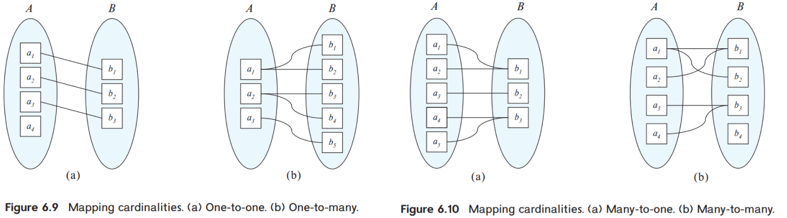

# 第6章 使用E-R图进行数据库设计

## 6.1 设计过程概览

本小节仅讨论设计数据库模式(database schema)。

### 设计阶段

- 用文字描述需求：这需要数据库设计者与领域专家和用户深入沟通，其产出是用户故事。

- 概念设计(conceptual design)：使用**实体-联系模型**，将需求转化为对数据库的图形化表述（概念模型）。需要定义数据库的实体、实体属性、实体间的联系、实体和联系上的约束。

  此外，还需要在**功能需求规格说明(specification of functional requirement)**中定义在数据上的操作。进而检查概念模型是否满足需求。

- 逻辑设计(logical design)：将概念模型映射为数据模型，即将E-R模型映射为关系模型。

- 物理设计(physical design)：指明数据库的物理特征，包括文件组织格式和索引结构。

## 6.2 E-R模型

### 实体(entity)

实体是指抽象或具象的事物，用属性来标识。

### 属性

实体有一组属性。我们可以用属性来区分不同实体。相同实体组成实体集(entity set)。和在数据库里一样，我们会选择部分属性作为主码来唯一标识实体。

我们称属性对应的值域为域(domain)。如果将属性及其取值描述为二元组(attribute, value)，那么实体可以表述为这种二元组的集合。

**null**

如果属性取值未知，可以填为null。

**属性的分类**

- 简单和复合属性(composite attributes)。复合属性是指可以被划分为更小属性的属性(component attributes)。若不能被划分，则为简单属性。

  

- 单值和多值属性。多值属性是指一个属性可以保存一组值，比如一个用户可以有多个字符串（多个电话号码）存储在phone_number中。表示为{phone_number}。

  

- 派生属性(derived attributes)：每次查询时通过计算其它属性得到值的属性。例如age，每次查询时计算当前时间与出生日期的差即可。其表示为age()。派生属性不作存储。

**属性的符号表示**

本节介绍E-R模型中实体属性的符号表示。

- 主键：在属性名下划线
- 复合属性：用缩进表示组合关系
- 多值属性：{属性名}
- 派生属性：属性名()

### 联系(relationship)

实体间的联系就是若干个实体集笛卡尔积的子集。我们称这个集合为联系集$R$。设联系集$R$涉及的实体为$E$，我们称$E$**参与**联系集$R$。

联系集的元素被称作联系实例(relationship instance)。

实例在联系中扮演的功能被称为角色(role)。通常可以省略。但在自环的联系(即实体集与自己的联系)中，角色是重要的。例如课程集的先修关系。

联系可以具有描述性属性。即每个联系实例能够具有属性。但联系实例必须能够仅由参与实体唯一标识（见6.3.码）。

对某个联系集，参与实体集的个数被称作该联系集的度(degree)。例如上图存在一个二元联系集，它的度为2。

如果实体集中的每一个实体都参与了实体集，我们称该实体集在联系中的参与是**全部**的。否则为**部分**参与。

**在设计E-R模型时，要明确有些信息是可以用联系集来实现的，而不一定要保存在实体的属性里。**这通常会使实体间的关系更清晰。例如学生所属的院系。

## 6.3 约束

### 映射基数(mapping cardinality)

映射基数表示**一个实体通过一个联系集能关联到的实体的个数**，这等价于一个实体能够参与的联系实例的个数。

本节只讨论二元联系集R。R涉及实体集A和B。根据映射基数，A与B的关系可被分为四类。

- 一对一：实体集A、B中的一个实体仅能参与一个联系实例。
- 一对多：A中的一个实体能参与多个联系实例，B中的一个实体仅能参与一个联系实例。
- 多对一：A中的一个实体仅参与一个联系实例，B中的一个实体能够参与多个联系实例。
- 多对多：A中的一个实体能关联多个B的实体，反之亦然。

### 码(key)

基于以下2点，我们可以用参与实体的主码来唯一标识联系实例。

- 实体可以用主码表示
- 实体可以唯一标识联系实例

即，用参与实体的主码的并集A来唯一标识联系实例。

对于联系实例的描述性属性，我们可以直接与A求并。

如果不同实体的主码有重名属性，用“实体.”区分。如果实体名称相同，则用角色区分。

## 6.4 E-R图

### 基本结构

- 分成两部分的矩形代表实体集。上半部分代表名称，下半部分代表属性。主码用下划线标识。
- 菱形代表联系集。
- 线段将实体集连接到联系集
- 虚线将描述性属性连接到联系集
- 双线表示实体集**完全**参与联系集
- 双菱形表示连接弱实体集的标志性联系集（见后文叙述）

### 映射基数

**非二元的联系集**

我们规定：在非二元的联系集中，至多只能存在一个箭头。它表示：其它实体集的一个**组合**只能参与一个联系实例。

**另一种表示**

这里的数字就是映射基数的范围。也就是说：一个学生只能参与一个关系，而一个教授能够参与多个关系。于是，这是一个一对多的联系。

### 属性

用缩进表示复合属性；用{}表示多值属性；用()表示派生属性，就像是一个函数。

### 角色

在到联系的实线上标注名称，以说明角色。

### 弱实体集

为避免冗余，我们允许实体集没有主码。没有足够属性形成主码的实体集被称作弱实体集(weak entity set)。有主码的实体集被称作强实体集(strong entity set)。

弱实体集A需要加上一些属性构成主码，这些属性需要在另一个实体集B中。我们称：A的标识实体集(identifying entity set)为B，B拥有(own)它所标识的实体集A。A与B的联系被称作标识性联系(identifying relationship)。需要注意，**弱实体集可以有多个标识实体集**。

弱实体集的主码由**标识实体集的主码和弱实体集自身属性**组成。后者被称为分辨符(discriminator attributes)。

需要注意，这种标识性联系是为了构成主码，那么，从A到B的联系应该是多对一的。

弱实体集可以参与其它联系，也可以作为其它弱实体集的属主(owner)。

我们有时也可以将弱实体集表示为标识实体集的一个多值复合属性。这取决于弱实体集的属性是否复杂，以及是否与其它实体集有联系。

**弱实体集的符号表示**

弱实体集的分辨符以**虚下划线**标明，而不是实线。关联弱实体集和标识性强实体集的联系集以**双菱形**表示。

## 6.5 转换为关系模式

本节讨论如何将E-R图转换为关系模式。我们约定：E表示E-R图的实体集，R表示E-R图的联系集，S表示关系模式的一张表。

### 具有简单属性的强实体集

E的一个实体对应S的一个元组。我们只需要根据E建立一张表即可。属性和主码可以直接照搬。

### 具有复杂属性的强实体集

- 复合属性

  将复合属性拆分，只保留叶子属性

- 多值属性

  为多值属性建立关系表A。A的属性包括该多值属性和实体集的主码。A的主码可以是所有属性，之后可以根据实际情况缩小范围。此外，A需要建立外键，即参照实体集对应的表B。

  显然，B不应保留多值属性。如果B只剩下主码，我们应当删去B以及外键关系，只保留A。

- 派生属性

  通过方法或函数实现。

### 弱实体集的表示

弱实体集为A，标识实体集为B。那么，A对应的关系模型S的属性由A的属性和B的主码构成。同时，S需要建立外键，即参照B的主码。需要注意，这一外键关系是**级联删除**的。

### 联系集的表示

联系集仍然会成为一个关系模型S。其属性是**联系集的描述性属性和参与实体集的主键的并**。我们需要建立外键约束。来自哪个实体集的属性就参照该属性集对应的表。

我们根据联系的特征选取主码：

- 对于多对多关系，参与实体集的主码的并集作为S的主码。
- 对于一对一的二元关系，任取一个实体集的主码作为S的主码。
- 对于一对多的二元关系，选择“多”（即一个实体只参与一个联系的实体集）主码作为S的主码。

如果重名，则改名。

### 关系模式的化简

**冗余**

弱实体集与标识实体集之间的联系集对应的模式是冗余的，不必给出。

**合并**

在处理多对一关系（例如，A与B是多对一关系）时，我们可以把联系集对应的表合并到A对应的表里，生成新表A'。这个新表的属性为AB和A表属性的并集。

一对一时，任取一个实体对应的表与联系集对应的表合并。

因为有可能只是部分参与，我们可以使用null。也就是说，与A合并后，B的属性可能取null.

## 6.6 拓展的E-R特性

### 特化、概化与属性继承

**特化(specialization**)实际上是一种设计过程。即先提出一个较为抽象的实体集，再细化，加一些差异性的属性。

**概化(generalization)**是一个自底向上的设计过程。

在这个过程中，我们规定存在**属性继承和联系继承**。即高层的属性和联系关系都被低层继承。

**其它概念**

- **部分概化**：存在高层实体没有低层实体
- **全部概化**：高层实体都有低层实体
- **不相交**：高层实体至多属于一个低层实体集，对应上图的合并箭头
- **重叠**：高层实体可以属于多个低层实体集，对应上图分开的箭头

### 聚集(aggregation)

我们可以将一个联系集及它所涉及的实体集抽象地视为一个实体集。我们称之为聚集。这主要是为了减少存储冗余。以下图为例，如果evaluation需要与instructor、project、student建立联系eval_for，就会再存储一遍在联系集proj_guide已经存储过的信息。于是，我们希望能够将联系集视作更高抽象的实体，即聚集。

聚集的含义是：建立一个多元组，这个多元组包括聚集内部参与联系集的所有实体集。

### 概化的关系模型表示

这个很简单，为每一个实体建表即可，其属性包括继承属性，并继承主码定义。此外，还需要定义外键：低层实体集的表需参照高层实体集的表。

如果概化是不相交且完全的，我们可以只建立低层实体集的关系模型。

### 聚集的关系模型表示

聚集内部有一个联系集A。聚集外联系集B的属性是A的主码、其它参与实体集的主码以及描述性属性，前两者构成B表主码。之后，转换聚集内部的联系集和实体集即可。自然，联系集A对应的表是多余的，它被B对应的表包含。

## 6.7 实体-联系的设计问题

### 实体集 vs 属性

对于一个对象而言，如果我们希望保存额外信息，我们会建立为实体集。反之可以作为其它实体集的一个属性。

常见错误：

- 将一个实体集的主码作为另一个实体集的属性，而非联系。
- 将主码作为联系集的属性。

### 实体集 vs 联系集

描述实体间行为时采用联系集。

### 二元 vs n元

只要添加足够多的辅助实体集、联系集，我们可以将n元联系转化为二元联系。

当然，我们还需要增加标识属性，以将(a,b,c)转化为(a,e),(b,e),(c,e)。

当然，有些n元联系会更自然，并且n元联系上的约束可能无法转化为二元约束。

### 联系集属性的设计

在一对多和一对一联系中，联系集的属性可以合并到实体集中。其规则和选择主码的规则类似：在一对多中，放到“多”的实体集中；在一对一中，任取一个即可。这是因为描述性属性需要与某一个联系实例绑定，而只有部分实体集的主键能够唯一确定联系实例。

但对于多对多联系，则只能以联系集的描述性属性表示。
