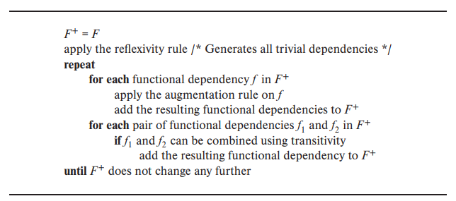
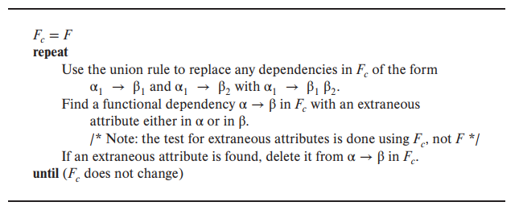
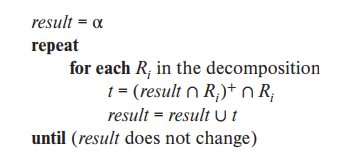
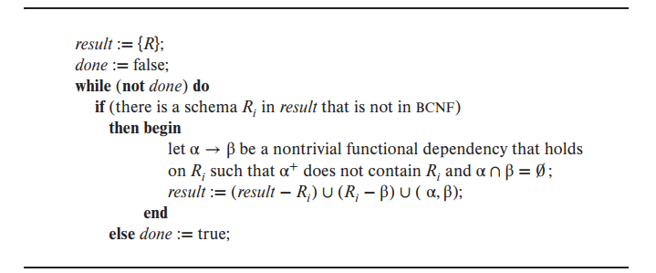
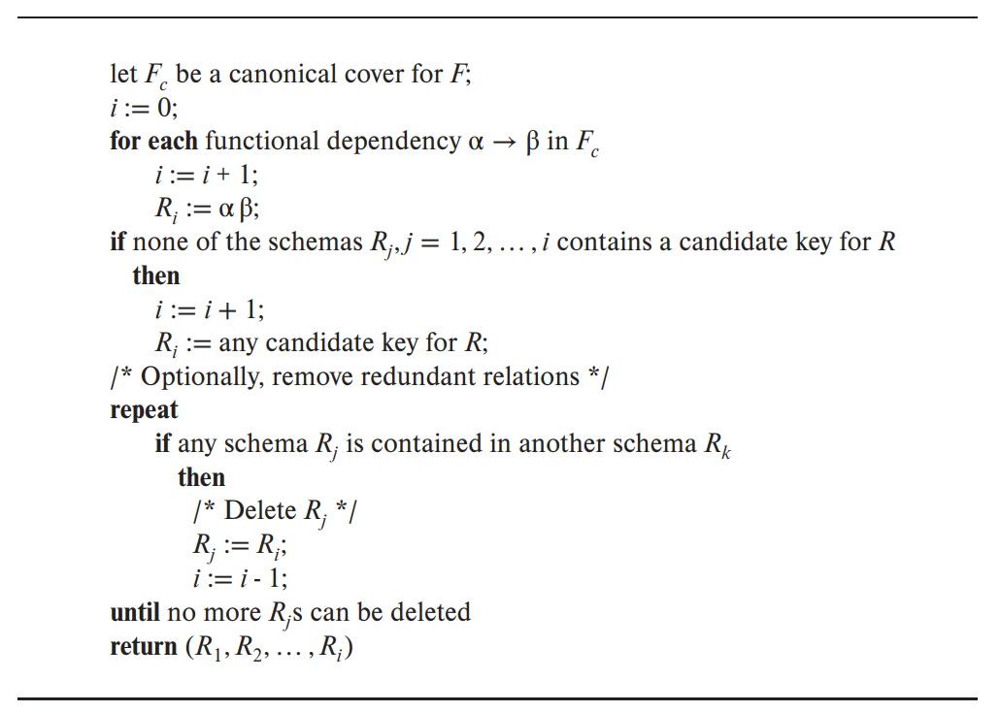

# 数据库原理 第7讲 关系数据库设计

> 作者：弗畔

关系数据库设计属于逻辑设计(Logical Design)部分。

本讲介绍的关系范式理论是为了设计出更好的、符合某些范式的关系模式。

本课程笔记先讲解函数覆盖理论，再讲解范式理论，或与课程讲授顺序不符。

## 函数覆盖理论

### 定义

函数依赖$A\rightarrow B$在关系模式R上成立(hold on)是指：
$$
A\rightarrow B\ \textbf{if.f}\ \  \forall t_1,t_2,\ t_1[A]=t_2[A]\rightarrow t_1[B]=t_2[B]
\\
\textbf{其中，} \ A \subseteq R.\textbf{attributes};\ B\subseteq R.\textbf{attributes};\ t_1,t_2为R的\textbf{tuple.}
$$
也就是说，对任意实例，属性集$A$的取值是相同的，属性集$B$的取值也必然相同。比如，主键相同时，其它属性也相同。

> 在后续表述中，如果关系模式$R$是不言自明的，我们将简称函数依赖关系为：$A\rightarrow B$成立。

**例子**

一个平凡的例子是：$A\rightarrow B,\  \text{if}\  B\subseteq A$。

如果$K\rightarrow A$成立，$A$为关系模式的所有属性，那么$A$是$R$上的超码。

从超码的角度来看，函数覆盖是一种**表达能力更强的、表达一致性约束**的工具。

**区分术语: satisfy, hold on**

关系实例$r$满足(satisfy)函数依赖$f$：只有关系实例r满足$f$。

函数依赖$f$在关系模式$R$上成立(hold on)：所有$R$的合法实例都满足$f$。

### 函数闭包

关系模式R上的函数依赖$f$构成**函数依赖集$F$**。从这个函数依赖集F出发，我们可能会推导出新的函数依赖式$f'$。我们称**$F$逻辑蕴含(logically imply)f'** 。

函数依赖集$F$的**闭包**$F^+$是指：被$F$逻辑蕴含的**所有函数依赖式**的集合。即：从$F$出发，所能够推出的所有函数依赖式。

### Armstrong公理

- 自反律：若$\beta \subseteq \alpha$，则$\alpha \rightarrow \beta$
- 增补律：若$\alpha\rightarrow \beta$，则$\gamma\alpha \rightarrow \gamma \beta$
- 传递律：若$\alpha \rightarrow \beta$且$\beta\rightarrow \gamma$，则$\alpha \rightarrow \gamma$

这三条公理是**可靠(sound)且完备(complete)**的。

**推论**

- 合并律：若$\alpha \rightarrow \beta$且$\alpha\rightarrow \gamma$，则$\alpha \rightarrow \beta\gamma$
- 分解律：若$\alpha \rightarrow \beta\gamma$，则$\alpha \rightarrow \beta$且$\alpha\rightarrow \gamma$
- 伪传递律：若$\alpha \rightarrow \beta,\beta\gamma\rightarrow \delta$，则$\alpha\gamma\rightarrow \delta$

依靠Armstrong公理及其推论，我们可以更容易地计算函数闭包。

### **计算函数闭包的算法**

类似于**不动点**的思想。只是规定了规则的使用顺序：先用自反和增补，再用传递。

### 属性闭包

如果$\alpha \rightarrow \beta$，我们称属性集$\beta$被属性集$\alpha$**函数确定**(functionally determine)。

属性闭包$\alpha^+$是指：在函数依赖集F下，被$\alpha$函数确定的**所有属性的集合**。

**算法**

实际上就是反复应用**传递律**+**不动点**。

时间复杂度：$O(|F|^2)$。

**用处**

- 判断是否是超码：如果$\alpha^+$包含所有元素，则$\alpha$是超码
- 检查函数依赖是否成立：$\alpha \rightarrow \beta$ 当且仅当 $\beta \subseteq \alpha^*$ 
- 计算函数依赖闭包的新策略：对每一个属性集，求出它的属性闭包

### 无关属性

我们希望在**保证闭包不变**的情况下，尽可能减少**函数依赖涉及的属性个数**。如果我们在一个函数依赖$f$中去掉了一个属性，但是函数依赖集$F$对应的闭包$F^+$没有改变，我们称这样的属性为**无关属性**。

对函数依赖集F中的$\alpha \rightarrow \beta$，无关属性分为两类，其判断方法是：

- **前提无关属性**：要求函数依赖集$F$上$\alpha-A \rightarrow \beta$成立。
  - 也就是需要在F上计算$\alpha-A$的属性闭包。如果闭包包含$\beta$，则A是无关属性。
- **结论无关属性**：要求$\alpha \rightarrow \beta -A$结合F中的其它函数依赖能推出$\alpha \rightarrow \beta$。
  - 也就是将$\alpha \rightarrow \beta-A$替换F中的$\alpha \rightarrow \beta$，计算$\alpha$的闭包。如果闭包包含$\beta$，则A是无关属性。

**强烈建议使用属性闭包的计算方法而不是自己去试。**

### 规范/标准覆盖

规范覆盖$F_C$是与$F$具有相同闭包的最小函数依赖集。这里的最小是指：函数依赖式的个数最少，每条函数依赖涉及的属性个数最少。自然，可能存在多个不相同的正则覆盖。

规范覆盖$F_C$满足：

- 不含有无关属性
- 每一条函数依赖的左半部不重复
- 逻辑蕴含$F$中的每一条函数依赖式
- $F_C$中的每一条函数依赖式都被$F$逻辑蕴含

**算法**

**算法思路是：先合并左半部相同的函数依赖式，再去除无关属性，直到收敛。**

### 保持依赖

为了使关系模式符合**某种范式**，我们需要将其拆分。考虑$R$被分解为若干个$R_i$的情况。$R_i$上的函数依赖集$F_i$是$F^+$中由$R_i$属性组成的所有函数依赖。

如果$F_i$在$R_i$上成立且$(F_1\cup F_2\cup...\cup F_n)^+=F^+$，则称分解是**保持依赖的(Dependency Preservation)**。

**算法**

注意：**如果F上的每一个函数依赖都能在分解得到的关系上验证，那么这个分解是保持依赖的**。但是，往往存在这样的函数依赖：它所包含的属性集真包含每一个分解。即总存在某属性是子表不包含的。这样的话，我们就无法将在分解后的子表上验证该函数依赖。

我们有两个算法验证保持依赖的分解。

1. 先求出$F_i$，再验证两个闭包是否相等（时间复杂度较高）。
2. 验证$F$中的每一个函数依赖$\alpha \rightarrow \beta$**在分解中成立**。基本思路是：将$\alpha$限定在子表上，遍历各子表，将得到的结果（属性闭包）取并。

## 范式理论

### 范式的定义

糟糕的模式设计往往会导致信息冗余，插入、删除、修改异常。

范式(normal form)是对关系模式的设计要求，是**评价关系模式设计好坏的标准**。

对于不满足范式的关系表，我们可以通过将其分解为多张表的方式将其转化为满足范式的表。

### 无损分解

为了使关系模式符合**某种范式**，我们需要将其拆分。对于拆分为两张表的情形，我们定义**无损分解**为：当且仅当子表的笛卡尔积等于父表。反之，我们称之为有损分解，即存在信息损失。

**判断法则**

**若子表的属性交集为某一个子表的超码，则分解为无损分解**

### 原子域与第一范式

原子域是指：表的属性是单值属性，不可再分。在本讲中，域都是原子域。

第一范式是指：**表的属性都是原子域的**。

### BCNF范式

**判定方法**

具有函数依赖集$F$的$R$属于BCNF(Boyce-Codd Normal Form)的条件是：$F^+$中所有形如$\alpha \to \beta$的函数依赖均至少满足下面一项条件：

- 是平凡的函数依赖($\text{i.e.}\ \beta \subset \alpha$)
- $\alpha$是R的超码

注意：**只看$F$也可以，不用检查$F^+$**。

**分解方法**

分解方法是指将表分解为若干各符合BCNF范式的子表。

具体思路是，遍历F中的每个函数依赖式，如果有不满足BCNF范式的表$R$，将其转化为两张表：$\alpha\cup \beta$和$R-(\beta-\alpha)$。

这是一种**无损分解**，但**可能不保持依赖**。

**检查分解后子表是否满足BCNF**

对于给定关系模式$R$，验证其按某种规则分解后的子表是否满足BCNF的情况。我们**不能只根据父表的$F$判断，而是需要查看$F^+_i$**。

另一种判断标准是：**对于$R_i$中的每一个属性子集$\alpha$，其在父表$F$下的属性闭包$\alpha^+$要么不包含$R_i-\alpha$里的属性，要么包含$R_i$的所有属性。**如果该标准被违背，$F^+$中包含的$\alpha \rightarrow (\alpha^+-\alpha)\cap R_i$会违背BCNF的要求。

### 第三范式

为了让分解保持依赖，我们引入第三范式。

#### 判定方法

具有函数依赖集$F$的$R$属于第三范式(3NF)的条件是：$F^+$中所有形如$\alpha \to \beta$的函数依赖均至少满足下面一项条件：

- 是平凡的函数依赖
- $\alpha$是R的超码
- $\beta - \alpha$中的每个属性A都包含于R的一个候选码中（不要求都包含于某一个候选码）

#### 分解方法

1. 求出规范覆盖$F_C$
2. 将规范覆盖$F_C$的函数依赖式转化为子表$R_i$
3. 如果没有$R_i$包含R的候选码，就新增一个表，这个表的属性是R的候选码
4. 去重，删除具有包含关系的表

这是一种**无损分解**，且**保持依赖**，但有可能引入冗余。

​    
