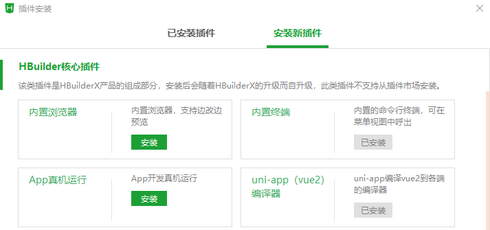
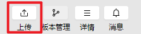
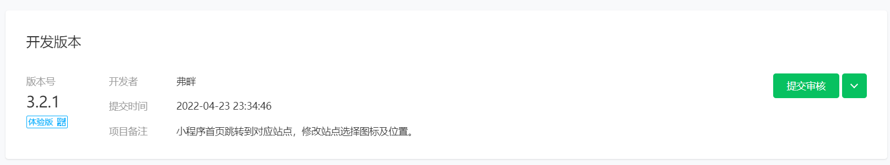
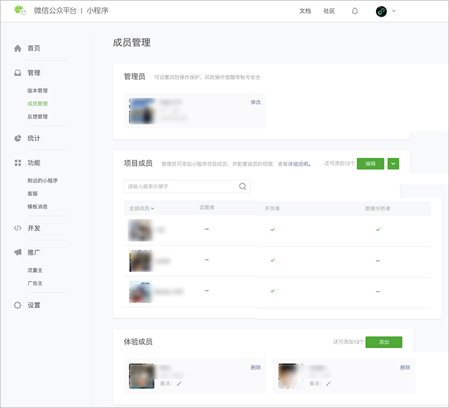

# 基于uni-app框架的微信小程序开发

> 讲解: 杨健辉

## 课程概要

[微信小程序](https://mp.weixin.qq.com/cgi-bin/wx)已成为生活中不可或缺的应用，例如北京健康宝、清华紫荆等。在此无需多言。

微信小程序开发框架有多种，如微信原生框架、uni-app等。

本教程将介绍基于uni-app框架的微信小程序开发。本着实用主义精神，本教程将着重带领读者了解uni-app开发的基本思路，而忽略具体原理。

本教程的先修知识是：了解Vue.js网页开发、HTML、JavaScript和CSS。

本教程用超链接关联大量相关文档，以便读者进一步学习。

**在正式开始前，请读者下载[示例代码文件](code.zip)。**因为示例代码比较简单且附有注释，故不做赘述。

由于作者水平有限，如有错误，还请读者不吝赐教。联系邮箱为：yang-jh19@mails.tsinghua.edu.cn

## uni-app框架

[uni-app](https://uniapp.dcloud.net.cn/) 是一个使用 [Vue.js](https://vuejs.org/)开发所有前端应用的框架，开发者编写一套代码，可发布到iOS、Android、Web（响应式）、各种小程序（微信/支付宝/百度/头条/飞书/QQ/快手/钉钉/淘宝）、快应用等多个平台。也就是说，我们会使用类似于Vue.js的风格写代码，uni-app会将代码转换为微信原生框架。

选择uni-app开发的好处是：**上手快**——直接依靠软院小学期的网页开发经验就可上手，无需学习微信原生框架。

### 软件安装

我们需要安装两个软件：[HBuilderX](https://www.dcloud.io/hbuilderx.html)和[微信开发者工具](https://developers.weixin.qq.com/miniprogram/dev/devtools/download.html)。此外，还需要注册账号：[HBuilderX使用的DCloud账号](https://dev.dcloud.net.cn/#/pages/common/register)和[微信公众平台的小程序账号](https://mp.weixin.qq.com/cgi-bin/registermidpage?action=index&lang=zh_CN&token=)。在进入下一步教程之前，请在这两个软件上登录账号。

由于篇幅所限，本教程将不介绍两软件的基本使用方式，请读者自行查阅。其基本思路是：在HBuilderX里[创建小程序项目](https://uniapp.dcloud.net.cn/quickstart-hx.html)、编写代码并[将代码转换到微信原生框架](https://blog.csdn.net/qq_39224105/article/details/109409075)。在微信开发者工具里运行代码、查看效果。

### 项目初始化

在HBuilderX里[创建小程序项目](https://uniapp.dcloud.net.cn/quickstart-hx.html)后，我们可以得到以下目录结构：

```
├─pages
│  ├─index
├─static
├─App.vue
├─index.html
├─main.js
├─manifest.json
├─pages.json
└─uni.scss
```

各文件的含义如下所示，本教程仅关注加粗的部分：

- **pages**是一个用来存放所有页面的文件夹。
- **static**是一个存放静态资源的文件夹，例如图片等。
- App.vue是页面入口文件，所有页面都是在 `App.vue` 下进行切换的，可以调用应用的生命周期函数
- **main.js**是项目入口文件，主要用来初始化 vue 实例并使用需要的插件。
- manifest.json是应用配置文件，用于指定应用的名称、图标、权限等。
- **pages.json**是全局配置文件，可以配置页面文件路径、窗口样式、原生的导航栏、底部 tab 栏等。
- uni.scss是 uni-app 的样式包。在其他文件中可以快速引用样式包里面的样式。

此时，我们就可以通过点击运行--运行到小程序模拟器--微信开发者工具将项目运行到微信开发者工具上。在此状态下，我们每保存一次代码，项目都会自动编译并反映在微信开发者工具上，添加新文件除外。

### 页面注册

页面注册是为了确定页面文件的路径，以便后续调用。

常见的应用小程序包含：首页、列表页、详情页、个人页。

我们需要在`pages.json`中**注册页面并配置导航栏**，如下列代码所示。导航栏`tabBar`在注册时需要明确每一个按钮的图标（区分选择与否）、下方显示文字和页面路径。这样，我们就实现了导航按钮与页面的绑定。当我们点击导航按钮时，程序会自动跳转到相应页面。微信对导航栏的配置做出一定限制，难以实现动态修改。如果想实现动态修改，需要自己造轮子或使用第三方库。

```js
//示例，仅包含首页与列表页的页面注册
"pages": [ //pages数组中第一项表示应用启动页，参考：https://uniapp.dcloud.io/collocation/pages
    {
        "path": "pages/index/index",
        "style": {
            "navigationBarTitleText": "uni-app"
        }
    },
    {
        "path": "pages/list/list",
        "style": {
            "navigationBarTitleText": "uni-app"
        }
    }
],
"tabBar": {
    "list": [{
        "iconPath": "static/index_icon.png",
        "selectedIconPath": "static/index_icon_selected.png",
        "text": "首页",
        "pagePath": "pages/index/index"
    },
             {
                 "iconPath": "static/list_icon.png",
                 "selectedIconPath": "static/list_icon_selected.png",
                 "text": "列表",
                 "pagePath": "pages/list/list"
             }
            ]
}
```

### 页面跳转

我们以点击列表项跳转到详情页为例，介绍相关知识。具体代码参见`pages/list/list.vue`和`pages/detail/detail.vue`。

示例的列表页实现了三个功能：**动态生成列表页、页面跳转、传递参数**。

列表页的动态生成比较简单，用`v-for`即可实现。需要注意的是：key属性需要为不重复的值。此外，当key值修改时，该组件会被重新渲染。如果我们动态修改组件属性后，组件没有发生变化，可以尝试修改key值（需保证唯一）。

```html
<list-item v-for="(item,index) in image_list" v-bind:number="item.number"  @click.native="redirect(item.number)"></list-item>
```

在uni-app中，实现页面跳转的函数是[uni.navigateTo](https://uniapp.dcloud.net.cn/api/router.html#navigateto)。更多页面出入栈操作参见[路由](https://uniapp.dcloud.net.cn/tutorial/page.html#路由)。

页面间传参有多种方式实现，一个比较简单的做法是使用[App.globalData](https://uniapp.dcloud.net.cn/collocation/App.html#globaldata)。它的使用方式是：在App.vue里注册，然后使用`getApp().globalData.xxx`调用即可。就像一个普通局部变量那样赋值或取值。

当然，navigateTo函数本身也可传参。如果想使用状态管理，请使用`vuex`（main.js中定义）

```vue
//App.vue
<script>
    export default {
        ...
        // globalData是简单的全局变量，如果使用状态管理，请使用vuex（main.js中定义）
        globalData:{
            detail_id:"0"
        }
    }
</script>
```

```js
//list.vue
redirect(index) {
    //通过全局变量传参
    getApp().globalData.detail_id = index;
    uni.navigateTo({
        url: '../../pages/detail/detail',
    })
}
```

```js
//detail.vue
//onReady为生命周期函数，参见生命周期函数部分的讲解
onReady(){
    // 通过全局变量 跨页面传参
    this.$set(this.$data, 'title', this.title+getApp().globalData.detail_id);
}
```

### 生命周期函数

生命周期函数是指：从对象的创建到销毁的过程中，所经过的一系列执行性函数。我们可以在这些函数中对每个时间点添加事件。例如，我们可以在页面加载(onLoad)和页面显示(onShow)两个时刻分别执行一些动作。这些动作就需要定义在该页面的对应生命周期函数中。在页面跳转部分的`detail.vue`代码中，我们在`onReady`函数中实现了标题的修改。`onReady`函数就属于生命周期函数。

在uni-app中，生命周期函数分为[应用](https://uniapp.dcloud.net.cn/collocation/App.html#applifecycle)、[页面](https://uniapp.dcloud.net.cn/tutorial/page.html#lifecycle)和[组件](https://uniapp.dcloud.net.cn/tutorial/page.html#componentlifecycle)三部分。具体函数的说明参见文档即可，在此不做赘述。

读者只需在各种生命周期函数中设置打印动作，即可清晰地看到各个生命周期函数的执行。需要注意：**导航栏页面和一般页面的销毁时机不同**。

### 组件化

[组件](https://uniapp.dcloud.net.cn/tutorial/vue-components.html#概念)是一个单独且可复用的功能模块的封装。简单来说，就是自定义的标签。

本节将重点介绍[组件的创建与使用](https://uniapp.dcloud.net.cn/tutorial/vue-components.html#注册)、[父组件向子组件传递参数](https://uniapp.dcloud.net.cn/tutorial/vue-components.html#传递静态或动态-prop)。具体代码参见`components/list-item/list-item.vue`。

**组件的创建与使用**

组件的创建是简单的。建议读者的组件文件需要满足`components/组件名称/组件名称.vue` 的目录结构。这是因为当组件文件满足这一要求时，**uni-app允许我们直接在页面中使用，而不必引用、注册**。这一点与Vue不同。

需要说明，**组件命名**也有要求，它只能为以下两种形式：

- 使用 kebab-case

  当使用 kebab-case (短横线分隔命名) 定义一个组件时，你也必须在引用这个自定义元素时使用 kebab-case，例如 `<my-component-name>`。

- 使用 PascalCase

  当使用 PascalCase (首字母大写命名) 定义一个组件时，你在引用这个自定义元素时两种命名法都可以使用。 也就是说 `<my-component-name>` 和 `<MyComponentName>` 都是可接受的。

**父组件向子组件传递参数**

至于传参，子组件需要在`props`里声明用于接收父组件参数的变量，父组件使用`v-bind`来向子组件传参。

```vue
<script>
    export default {
        props: {
            number: Number
        },
    }
</script>
```

```vue
<list-item v-for="(item,index) in image_list" v-bind:number="item.number"  @click.native="redirect(item.number)"></list-item>
```

最后，读者可能想要在一个组件的根元素上直接监听一个原生事件（例如，点击事件）。 这时，你可以使用 @事件的 `.native` 修饰符。不然将无法监听。

### 网络通信与拦截器

本节介绍使用[Axios](https://www.axios-http.cn/)实现网络通信。

**准备工作**

- [安装Node.js和npm]([(29条消息) node.js和npm的安装与环境配置（2021最新版）_小绵杨Yancy的博客-CSDN博客_npm安装](https://blog.csdn.net/ZHANGYANG_1109/article/details/121229581))。

- 安装HBuilderX插件：内置终端。方法是：在HBuilderX中点击工具--插件安装--安装新插件--内置终端。

  

- 点击左下方的终端（Alt+c），输入`npm install axios`以安装Axios。安装成功后，根目录下会生成`node_modules`文件夹，在其中可以看到axios。

**配置**

在根目录下创建`api`目录，并在其中创建`https.js`、`base.js`、`index.js`和`personApi.js`文件。这四个文件的功能分别是：创建`axios`实例并设置拦截器（拦截器的作用是：在发出包前和收到包后对包做一些操作，比如打印出包的内容）；接口域名的管理，以使简化代码；对外统一暴露接口；定义person页的具体接口。此外，还需要在`main.js`中将axios和api挂载到Vue上以便于访问，并加入适配器代码以实现跨域。具体实现参见实例代码，不再赘述。

使用起来很方便，如下所示：

```js
this.$api.person_api.getIdentityStr({
    str:"Tsinghua"
}).then(res => {
    if (res.data == null || res.data == "" || res.data == undefined) {
        console.log("Error,,data is None");
    } else {
        var data = res.data.str;
        this.$set(this.profile_text, 'nickname', data);
    }
})
    .catch((error) => {
    console.log(error);
});
```

**微信小程序**

请读者注意：微信小程序**只可以跟指定的域名进行网络通信，且必须使用 HTTPS/WSS 发起网络请求**。

在开发阶段，可以在微信开发者工具里先设置不检查域名。

如果读者想发布小程序，则必须设置服务器域名。读者可以在微信工作平台中设置服务器域名。具体方法是：点击微信公众平台--开发--开发管理--开发设置--服务器域名。在设置域名后，通常需要等待几小时才会生效。读者可以取消不检查域名的设置，以检验是否生效。

### 杂项

**原型设计**

原型设计的重要性无需多言。在此介绍两个原型设计工具：[墨刀](https://modao.cc/)和[Figma](https://www.figma.com/login)。后者对团队协作更友好。

**界面布局**

建议优先使用[Flex 布局](http://www.ruanyifeng.com/blog/2015/07/flex-grammar.html)。

**尺寸单位**

uni-app使用的尺寸单位是：[rpx](https://uniapp.dcloud.net.cn/tutorial/syntax-css.html#尺寸单位)，它是一种根据屏幕宽度自适应的动态单位，其基准为750rpx。缩放公式为： 1px / 设计稿基准宽度 =  1rpx / 750rpx。简单来说，就是程序员只需考虑在750px的屏幕上绘制元素，程序会自动根据屏幕尺寸自动缩放元素大小。

如果不希望缩放，读者可以直接使用px。

**组件标签**

uni-app提供了一系列组件，即在`<template>`之间出现的各类标签。需要注意：uni-app将HTML里的标签也视作组件，并定义了[HTML标签和uni-app内置组件的映射关系](https://zh.uniapp.dcloud.io/vernacular.html#组件-标签的变化)。例如，将div 改成 [view](https://uniapp.dcloud.io/component/view)。

**特殊情况**

如果uni-app没有提供所需功能，而微信原生框架提供了，可以尝试直接使用微信的属性而非uni-app的。

## 微信小程序的测试与发布

在开始之前，读者需要在微信公众平台注册小程序账号并填写相关信息。该账号会与微信绑定。

### 功能测试

**上传代码**

为了将代码上传到微信公众平台，我们需要设置小程序的AppId。它是小程序的唯一标识。具体操作如下：

- 获取[AppId](https://zhuanlan.zhihu.com/p/385731596)
- 将该AppId写入项目基本信息，具体操作为：微信开发者工具--右侧详情--基本信息--AppId修改

之后，我们点击微信开发者工具右上方的上传按钮即可。



上传代码后，可以在微信公众平台--管理--版本管理处查询到相关信息并使用**体验版**。



**体验版与成员管理**

只有管理员、项目成员和体验成员才能使用体验版小程序。具体管理方法参见[官方文档](https://kf.qq.com/faq/170302zeQryI170302beuEVn.html)。

这样，读者就可以使用小程序体验版进行功能测试了。



### 代码发布

微信小程序的发布共分三步：**上传代码、提交审核、代码发布**。其中，上传代码的步骤与上文一致，不再赘述。

需要注意的是：提交审核之前，每个微信小程序需要事先设置通讯域名，否则无法进行网络通信。如前文所述，小程序**只可以跟指定的域名进行网络通信，且必须使用 HTTPS/WSS 发起网络请求**。服务器域名的设置方法是：点击微信公众平台--开发--开发管理--开发设置--服务器域名。在设置域名后，通常需要等待几小时才会生效。读者可以取消微信开发者工具里不检查域名的设置，以检验是否生效。

**提交审核**

登录微信公众平台，进入开发管理，开发版本会展示已上传的代码，管理员可提交审核或是删除代码。

**代码发布**

代码审核通过后，需要开发者手动点击发布，小程序才会发布到线上提供服务。

详情参见[微信官方文档](https://developers.weixin.qq.com/miniprogram/introduction/#开发前准备)。

## 更多

通过阅读本教程，相信读者对基于uni-app框架的微信小程序开发有了基本的了解。当然，如果想优雅地写出高质量代码，亦或是满足复杂需求，仅仅依靠上述知识是不够的。读者可以自行搜索或阅读[uni-app官方文档](https://uniapp.dcloud.net.cn/)、[微信开放文档 以进一步学习。

由于作者水平有限，如有错误，还请读者不吝赐教。联系邮箱为：yang-jh19@mails.tsinghua.edu.cn

[点击下载pdf](基于uni-app框架的小程序开发.pdf)