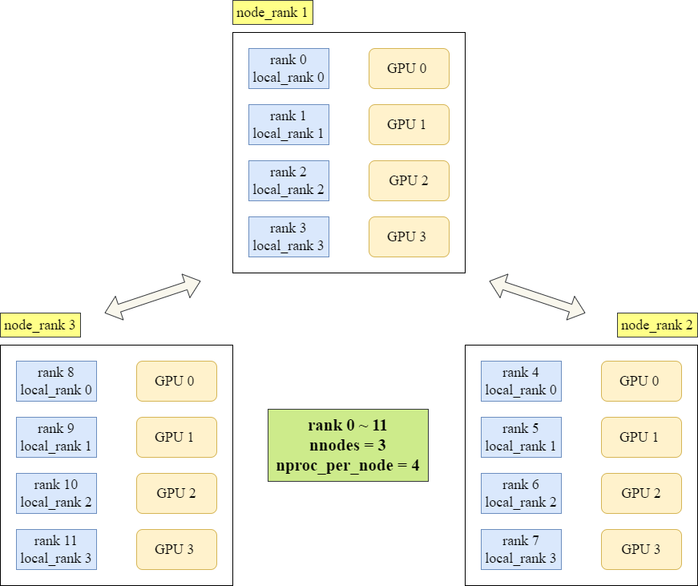

# Distributed Data Parallel 详解


> 作者：光火
>
> 邮箱：victor_b_zhang@163.com


_Distributed Data Parallel_ 简称 `DDP`，是 _PyTorch_ 框架下一种适用于单机多卡、多机多卡任务的**数据并行**方式。由于其良好的执行效率及广泛的显卡支持，熟练掌握 `DDP` 已经成为深度学习从业者所必备的技能之一。本文结合具体代码，详细地说明了 `DDP` 在项目中的使用方式。读者按照本文所给的范例，只需稍经调试，即可实现 `DDP` 的整套流程。

## 概念辨析

- 具体讲解 `DDP` 之前，我们先了解了解它和 _Data Parallel_ (`DP`) 之间的区别。`DP` 同样是 _PyTorch_ 常见的多 _GPU_ 并行方式之一，且它的实现非常简洁：

    ```python
    # 函数定义
    torch.nn.DataParallel(module, device_ids=None, output_device=None, dim=0)
    '''
    module : 模型
    device_ids : 参与训练的 GPU 列表
    output_device : 指定输出的 GPU, 通常省略, 即默认使用索引为 0 的显卡
    '''
    
    # 程序模板
    device_ids = [0, 1]
    net = torch.nn.DataParallel(net, device_ids=device_ids)
    ```

    基本原理及固有缺陷：在 _Data Parallel_ 模式下，数据会被自动切分，加载到 _GPU_。同时，模型也将拷贝至各个 _GPU_ 进行正向传播。在多个进程之间，会有一个进程充当 _master_ 节点，负责收集各张显卡积累的梯度，并据此更新参数，再统一发送至其他显卡。因此整体而言，_master_ 节点承担了更多的计算与通信任务，容易造成网络堵塞，影响训练速度。
    
    常见问题及解决方案：_Data Parallel_ 要求模型必须在 _device_ids[0]_ 拥有参数及缓冲区，因此当卡 _0_ 被占用时，可以在 `nn.DataParallel` 之前添加如下代码：
    
    ```python
    # 按照 PIC_BUS_ID 顺序自 0 开始排列 GPU 设备
    os.environ['CUDA_DEVICE_ORDER'] = 'PIC_BUS_ID'
    # 设置当前使用的 GPU 为 2、3 号设备
    os.environ['CUDA_VISIBLE_DEVICES'] = '2, 3'
    ```
    
    如此，_device_ids[0]_ 将被默认为 _2_ 号卡，_device_ids[1]_ 则对应 _3_ 号卡
    
- 相较于 `DP`, _Distributed Data Parallel_ 的实现要复杂得多，但是它的优势也非常明显：
    - `DDP` 速度更快，可以达到略低于显卡数量的加速比；
    - `DDP` 可以实现负载的均匀分配，克服了 `DP` 需要一个进程充当 _master_ 节点的固有缺陷；
    - 采用 `DDP` 通常可以支持更大的 _batch size_，不会像 `DP` 那样出现其他显卡尚有余力，而卡 _0_ 直接 _out of memory_ 的情况；
    - 另外，在 `DDP` 模式下，输入到 _data loader_ 的 _bacth size_ 不再代表总数，而是每块 _GPU_ 各自负责的 _sample_ 数量。比方说，_batch_size = 30_，有两块 _GPU_。在 `DP` 模式下，每块 _GPU_ 会负责 _15_ 个样本。而在 `DDP` 模式下，每块 _GPU_ 会各自负责 _30_ 个样本；

- `DDP` 基本原理：倘若我们拥有 _N_ 张显卡，则在 _Distributed Data Parallel_ 模式下，就会启动 _N_ 个进程。每个进程在各自的卡上加载模型，且模型的参数完全相同。训练过程中，各个进程通过一种名为 _Ring-Reduce_ 的方式与其他进程通信，交换彼此的梯度，从而获得所有的梯度信息。随后，各个进程利用梯度的平均值更新参数。由于初始值和更新量完全相同，所以各个进程更新后的参数仍保持一致。

## 常用术语

- _rank_
    - 进程号
    - 多进程上下文中，通常假定 _rank = 0_ 为主进程或第一个进程
- _node_
    - 物理节点，表示一个容器或一台机器
    - 节点内部可以包含多个 _GPU_
- _local_rank_
    - 一个 _node_ 中，进程的相对序号
    - _local_rank_ 在 _node_ 之间独立
- _world_size_
    - 全局进程数
    - 一个分布式任务中 _rank_ 的数量
- _group_
    - 进程组
    - 一个分布式任务就对应一个进程组
    - 只有当用户创立多个进程组时，才会用到




## 代码实现

- _Distributed Data Parallel_ 可以通过 _Python_ 的 `torch.distributed.launch` 启动器，在命令行分布式地执行 _Python_ 文件。执行过程中，启动器会将当前进程（其实就是 _GPU_）的 _index_ 通过参数传递给 _Python_，而我们可以利用如下方式获取这个 _index_：
    ```python
    import argparse
    
    parser = argparse.ArgumentParser()
    parser.add_argument('--local_rank', default=-1, type=int,
                        metavar='N', help='Local process rank.')
    args = parser.parse_args()
    
    # print(args.local_rank)
    # local_rank 表示本地进程序号
    ```
- 随后，初始化进程组。对于在 _GPU_ 执行的任务，建议选择 `nccl` (由 _NVIDIA_ 推出) 作为通信后端。对于在 _CPU_ 执行的任务，建议选择 `gloo` (由 _Facebook_ 推出) 作为通信后端。倘若不传入 `init_method`，则默认为 `env://`，表示自环境变量读取分布式信息
    ```python
    dist.init_process_group(backend='nccl', init_method='env://')
    
    # 初始化进程组之后, 通常会执行这两行代码
    torch.cuda.set_device(args.local_rank)
    device = torch.device('cuda', args.local_rank)
    
    # 后续的 model = model.to(device), tensor.cuda(device)
    # 对应的都是这里由 args.local_rank 初始化得到的 device
    ```
- 数据部分，使用 _Distributed Sampler_ 划分数据集，并将 _sampler_ 传入 _data loader_。需要注意的是，此时在 _data loader_ 中不能指定 _shuffle_ 为 _True_，否则会报错 (_sampler_ 已具备随机打乱功能)
    ```python
    dev_sampler = data.DistributedSampler(dev_data_set)
    train_sampler = data.DistributedSampler(train_data_set)
    
    dev_loader = data.DataLoader(dev_data_set, batch_size=dev_batch_size, 
                                 shuffle=False, sampler=dev_sampler)
    train_loader = data.DataLoader(train_data_set, batch_size=train_batch_size, 
                                   shuffle=False, sampler=train_sampler)
    ```
- 模型部分，首先将将模型送至 _device_，即对应的 _GPU_ 上，再使用 _Distributed Data Parallel_ 包装模型（顺序颠倒会报错）
    ```python
    model = model.to(device)
    model = nn.parallel.DistributedDataParallel(
        model, device_ids=[args.local_rank], output_device=args.local_rank
    )
    ```
- _Distributed Data Parallel_ 模式下，保存模型应使用 `net.module.state_dict()`，而非 `net.state_dict()`。且无论是保存模型，还是 _LOGGER_ 打印，只对 _local_rank_ 为 _0_ 的进程操作即可，因此代码中会有很多 `args.local_rank == 0` 的判断
    ```python
    if args.local_rank == 0:
        LOGGER.info(f'saving latest model: {output_path}')
        
        torch.save({'model': model.module.state_dict(), 
                    'optimizer': None, 'epoch': epoch, 'best-f1': best_f1}, 
                   open(os.path.join(output_path, 'latest_model_{}.pth'.format(fold)), 'wb'))
    ```
- 利用 `torch.load` 加载模型时，设置 `map_location=device`，否则卡 _0_ 会承担更多的开销
    ```python
    load_model = torch.load(best_path, map_location=device)
    model.load_state_dict(load_model['model'])
    ```
- `dist.barrier()` 可用于同步多个进程，建议只在必要的位置使用，如初始化 `DDP` 模型之前、权重更新之后、开启新一轮 _epoch_ 之前
- 计算 _accuracy_ 时，可以使用 `dist.all_reduce(score, op=dist.ReduceOp.SUM)`，将各个进程计算的准确率求平均
- 计算 _f1-score_ 时，可以使用 `dist.all_gather(all_prediction_list, prediction_list)`，将各个进程获得的预测值和真实值汇总到 _all_list_，再统一代入公式

## 启动方式

- `torch.distributed.launch` 
    ```python
    # 此处 --nproc_per_node 4 的含义是 server 有 4 张显卡
    python torch.distributed.launch --nproc_per_node 4 train.py
    
    # 倘若使用 nohup, 则注意输入命令后 exit 当前终端
    python torch.distributed.launch --nproc_per_node 4 train.py
    ```
- `torchrun`，推荐使用这种方式，因为 `torch.distributed.launch` 即将弃用
    - 代码中，只需将 _Argument Parser_ 相关的部分替换为
        ```python
        local_rank = int(os.environ['LOCAL_RANK'])
        ```
      然后将 `args.local_rank` 全部改为 `local_rank` 即可
    - 启动命令
        ```python
        # 单机多卡训练时, 可以不指定 nnodes
        torchrun --nnodes=1 --nproc_per_node=4 train.py
        
        # 倘若使用 nohup, 则注意输入命令后 exit 当前终端
        nohup torchrun --nnodes=1 --nproc_per_node=4 train.py > nohup.out &
        ```