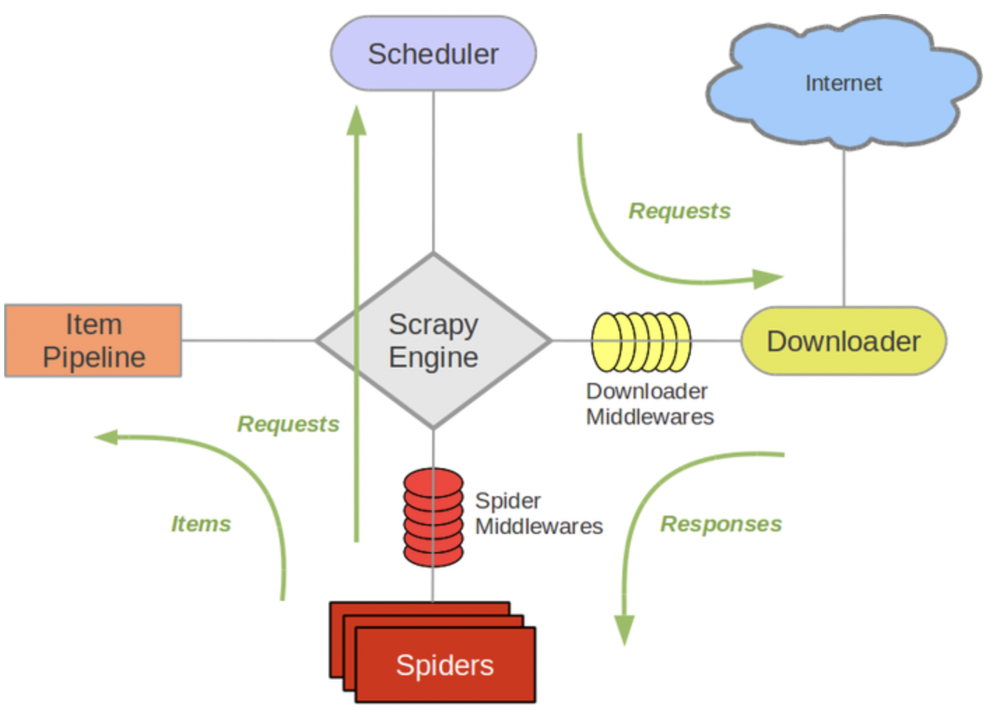
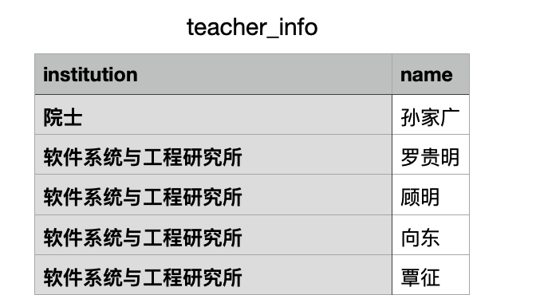

# Scrapy学习笔记

> 作者：Kirino
> 联系方式: he-jx19@mails.tsinghua.edu.cn

Scrapy是一个常用的Python爬虫框架，主要由`Spider`、`Engien`、`Scheduler`和`Downloader`组成。运行机制如下图所示



`Spider`发出请求（包括目标url、请求体等），经过中间件包装后发送到`Engine`。`Engine`再把请求派发给`Scheduler`，`Scheduler`按照任务队列的形式，将请求经中间件处理后调用`Downloader`下载请求资源。在`Spider`拿到响应，解析资源后可以交给`Item Pipeline`进行进一步处理。

## 安装方法

直接使用`pip`安装即可

```shell
$ pip install scrapy
```

查看是否安装成功

```shell
$ scrapy version  
Scrapy 2.6.2
```

## 最小程序

以从https://www.thss.tsinghua.edu.cn/szdw/jsml.htm爬取得软件学院所有老师和所属研究所为例。

### 新建项目

在当前的项目文件夹下执行下面的命令，新建一个scrapy项目。

```shell
$ scrapy startproject mySpider
```

之后，会出现一个以`mySpider`为名的文件夹。在`mySpider/spider/`文件夹下，我们就可以定义我们的`sipder`。

### 定义Spider

一只最简单的`spider`需要继承scrapy的抽象基类`scrapy.Spider`，定义`name`和要爬取的url，然后实现`parse`方法。`parse`方法会作为请求成功后的默认回调，处理响应。

例如，我先把网页内容爬取并保存

```python
# spider/thss_spider.py
class ThssSpider(scrapy.Spider):
    name = "thss"
    start_urls = ['https://www.thss.tsinghua.edu.cn/szdw/jsml.htm']

    def parse(self, response, **kwargs):
        page = response.url.split("/")[-2]
        filename = f'thss-{page}.html'
        with open(filename, 'wb') as f:
            f.write(response.body)
        self.log(f'Saved file {filename}')
```

### 运行Spider

使用下面的指令可以通过指定spider name启动对应的spider

```shell
$ scrapy crawl thss
```

实际上，在启动`spider`后，`Engine`会遍历`start_urls`，隐式地调用下面的代码

```python
for url in start_urls:
    yield scrapy.Request(url=url, callback=parse) 
```

即向对应的url发送请求并收到响应后，实例化一个`Response`对象，并且调用`parse`方法进行解析。

当然，我们也可以显式地调用上面的代码，只需要在`Spider`类中实现`start_request`方法即可。

运行后，我们得到了一个新增文件`thss-szdw.html`，里面就保存了https://www.thss.tsinghua.edu.cn/szdw/jsml.htm的网页内容。

```html
<!DOCTYPE html>
<html data-n-head-ssr>

<head>
    <title>教师名录-清华大学软件学院</title><META Name="keywords" Content="清华大学软件学院,教师名录" />
    ...
</html>
```

> Scrapy还提供一个交互式的shell，通过运行`scrapy shell 'https://www.thss.tsinghua.edu.cn/szdw/jsml.htm'`即可打开。在这个shell里，可以通过response变量访问到我们请求的响应。

### 定义数据结构

我们想要得到每位老师以及对应的研究所，Scrapy下的`item pipline`为我们提供了方便的数据存储功能。在`myScrapy/items.py`中，定义了我们自己的`Item`类，继承自`scrapy.Item`。它可以通过`data1 = scrapy.Feild()`的方式定义结构化数据字段，与Dict类似，但是提供了更好的封装。

在这里，我们保存教师名和所属研究所

```python
class MyscrapyItem(scrapy.Item):
    institution = scrapy.Field()
    name = scrapy.Field()
```

### 数据解析

我们需要对抓取下来的网页结构先进行人工分析。分析可发现，与教师-机构相关的部分呈现下面的结构。

```html
<div class="group-title">某个研究所</div>
<div class="group-people">
    <div class="name-container"><a>老师1</a></div>
    <div class="name-container"><a>老师2</a></div>
</div>
```

`Scrapy.Response`类提供了通过css选择器进行查询的方法。若在Scrapy Shell中，我们可以直接通过`response.css('css selector')`的方法进行选择。注意，`.css()`会返回一个子选择器（列表），我们可以通过在子选择器上调用`.get()`方法查看选择到的内容。也可以把这个选择器保存下来，再进行进一步选择。

以上面的数据为例，选择研究所可以通过`div.group-title`。因为不止一个研究所，因此会返回一个列表。我们可以查看第一项

```shell
>>> response.css('div.group-title')[0].get()
'<div class="group-title">院士</div>'
```

发现把整个`div`标签都返回了回来。如果我们只想要标签中包裹的内容，可以在选择时指定`::text`

```shell
>>> response.css('div.group-title::text')[0].get()
'院士'
```

接下来，我们获取每个研究所下的老师。这一步，我们就需要先通过`div.group-people`获得所有研究所的子选择器列表，然后把列表中的每一项保存起来，即是一个研究所的子选择器。之后，再在这个选择器上通过`a`标签获得老师名字。

```shell
>>> ins2 = response.css('div.group-people')[1]
>>> ins2.css('a::text').getall()
['罗贵明', '顾明', '向东', '覃征', '罗平', '赵曦滨', '邓仰东', '贺飞', '张荷花', '万海', '周旻', '高跃', '姜宇']
```

按上面的方法，我们就获得了软件系统与工程研究所所有老师的姓名。

### 保存数据

接下来，我们只需要将获得的数据储存到定义好的数据结构`MyscrapyItem`中即可。为此，我们需要在`thss_spider.py`文件中引入`MyscrapyItem`，同时需要再将上面的信息储存在一个列表中。

```python
from myScrapy.items import MyscrapyItem

def parse(self, response, **kwargs):
    items = []
    institutions = response.css('div.group-title::text').getall()
    for i, institution in enumerate(institutions):
        teachers = response.css('div.group-people')[i].css('a::text').getall()
        for teacher in teachers:
            item = MyscrapyItem()
            item['name'] = teacher
            item['institution'] = institution
            items.append(item)
	return items
```

### 导出数据

Scrapy支持我们将爬取到的数据以`.json, .jsonl, .csv, .xml`四种格式保存。只需要在爬虫命令后加上`-o`指令，后跟输出文件名即可。

例如，我们可以以`csv`格式导出

```shell
$ scrapy startproject mySpider -o teacher_info.csv
```

在Excel或者Numbers中打开，则可以看到下面的结果



