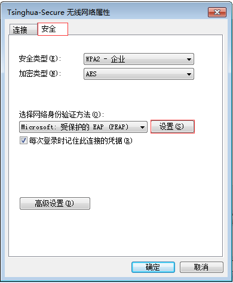
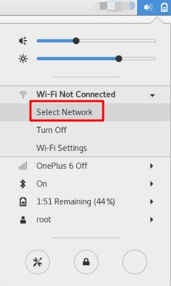

# 如何上网——关于Tsinghua Secure

清华无线校园网802.1x认证系统已正式开通，无线信号名称是“**Tsinghua-Secure**”。

用户只需通过校园网账号登录自服务系统（**http://usereg.tsinghua.edu.cn**）注册**802.1x**认证系统的密码，一次性配置用户终端设备（电脑、手机、PAD等），以后无需再做任何登录认证操作，直接可以上网。

使用802.1x认证系统需要进行以下两个操作步骤:

1. 注册 802.1x 的密码；
2. 配置用户端的设备。
   
详细操作说明如下:

## 一、注册802.1密码

1. **注册密码**：登录自服务系统： http://usereg.tsinghua.edu.cn，选择“ 802.1x 功能”下的“自注册及修改口令”。在密码及确认密码的区域输入密码后，点击“确定”按钮后，即注册802.1x密码成功。如下图所示：

2. **注意事项**：为确保校园网账号安全，请勿将 802.1x 密码设置为校园网账号密码。

3. **若需更改密码**：登录自服务系统：http://usereg.tsinghua.edu.cn ，按照上述步骤操作。

## 二、配置用户端设备

用户终端设备需按不同的操作系统进行配置， Windows/Android/iOS/macOS/Linux 等不同系统下的配置方法如下:

### 2.1 Windows10 系统下配置 802.1x 的方法

1. 确认终端在信号覆盖范围内：查找是否能找到 802.1X SSID“ **Tsinghua-Secure**”如果能找到则可以进行下一步。
*如果找不该信号，这说明本地区不在信号覆盖范围内。*
2. 选择**Tsinghua-Secure**，点击“连接”
如下图所示：
  
1. 输入用户名：即“**校园网账号**”
密码：对应账号下的**802.1X密码**
点击“确定”，之后继续点击“连接”

### 2.2 Windows 7 系统下的配置 802.1x 的方法
 
1.  选择“控制面板”→“查看网络状态和任务”→“网络和共享中心”→“管理无线网络”→进入“管理无线网络窗口”,单击“添加”按钮；

      
2.  设置无线网络信息：选择“手动创建网络配置文件(M)”: 网络名:Tsinghua-Secure；安全类型:WPA2-企业； 加密类型：AES；其它保持缺省配置，然后单击“下一步”，点击：“更改连接设置”；

   
3.  配置无线网络安全属性: 点击“安全”属性，按照下图中的标识进行配置：

1） 在“选择网络身份验证方法”-“**设置**”进入受保护的EAP属性页面

2） **取消勾选**“通过验证证书来验证服务器的身份”（，选择身份验证方法中选择“**安全密码（EAP-MSCHAP v2）**”选项，同时保持勾选“**启用快速重新连接**”，点击“配置”。

3） 在弹出的“**EAP MSCHAPv2属性**”界面中：**取消勾选**“自动使用Windows登录名和密码”。

4） 进入“**高级设置**”界面后，如下图，在“**802.1X设置**”栏下**勾选**“指定身份验证模式”，选择“**用户或计算机身份验证**”。

5） 选择“**802.11设置**”栏，如下图，在快速漫游栏目下**取消勾选**“启动成对主密钥（PMK）缓存”，点击“确定”。

      
        
4.  选择并连接 SSID 为 Tsinghua-Secure 的无线网，输入校园网账号和在usereg.tsinghua.edu.cn 中设置的 802.1x 的密码，完成连接。

        
### 2.3 Android 系统下的配置 802.1x 的方法

1.  连接 82.1X SSID Tsinghua-Secure；
   
        
2.  按下图填写，身份和密码为校园网账号和在 usereg.tsinghua.edu.cn 中设置的 802.1x的口令。点击连接后完成配置。
  
        
### 2.4 iPhone、iPad 下的配置 802.1x 的方法

1.  设置---无线局域网中连接 802.1X SSID ：Tsinghua-Secure

2.  输入校园网账号和口令，身份和密码为校园网账号和在 usereg.tsinghua.edu.cn 中设置的 802.1x 的口令。

        
3.  点击信任，首次连接会提示信任该证书，再次连接不会出现该提示。
    
        
### 2.5 macOS 下的配置 802.1x 的方法
    
1.  连接 802.1X SSID: Tsinghua-Secure；
  
    
2.  输入用户名密码：用户名和密码为校园网账号和在 usereg.tsinghua.edu.cn 中设置的802.1x 的口令，点击加入；

        
3.  点击继续；

4.  连接 802.1XSSID: Tsinghua-Secure 后会提示输入 MAC 主机的账号和密码（并非校园网联网账号和密码）；第一次连接时会出现，之后不再出现。输入成功后完成配置。

          
### 2.6 Linux 系统下配置 802.1x 的配置方法

#### 1、以 CentOS 7.0 为例，内核版本号：Linux version 3.10.0-957.1.3.el7.x86\_64

1.1、图形化连接方法：
    
① 点击状态栏“声音”或者“电池”的图标，然后选择“select network”：

② 选择“Tsinghua-Secure”：

    
③ 在弹出的输入框中，将“Authentication”选择为“Protected EAP(PEAP)”，勾选“No CA certificate is required”，“ PEAP version”选择为“Automatic” ， “Inner authentication”选择为“MSCHAPv2”，最后输入用户名、密码，即可连接成功。

    
1.2、命令行连接方法：

① 在 Terminal 中，通过命令“iw dev”查看无线网卡的标识：
  

② 通过如下命令，创建用于连接 802.1x 无线网络的配置文件：

③ 通过如下命令，查看已经存在的网络配置文件：

\# nmcli connection show

④ 通过如下命令，将刚创建的配置文件绑定到无线网卡上

\# nmcli connection up Tsinghua-Secure ifname wl01

⑤ 查看是否成功连接到 802.1x 网络及网卡的 IP 地址

\# nmcli connection show 
\# ifconfig wlo1

#### 2、以 Ubuntu16.04 + GUI 为例

1.  选择认证方式为 PEAP 类型
    
2.  勾选不使用 CA 证书
    
3.  内部认证选择 MSCHAPV2 类型
    
4.  填写校园网用户名以及在 https://usereg.tsinghua.edu.cn 网站内注册的 802.1x 密码

## 三、用户服务 

使用过程中，如有问题可通过以下方式获得帮助服务：热线电话：010-62784859

[服务邮箱：its@tsinghua.edu.cn](mailto:its@tsinghua.edu.cn)

接待服务：信息化技术中心用户服务大厅（李兆基大楼东2门A128室） 企业微信号：关注“清华大学信息服务”，通过网络服务选项进行咨询。
