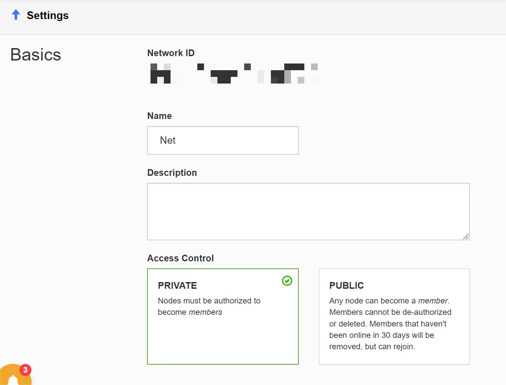
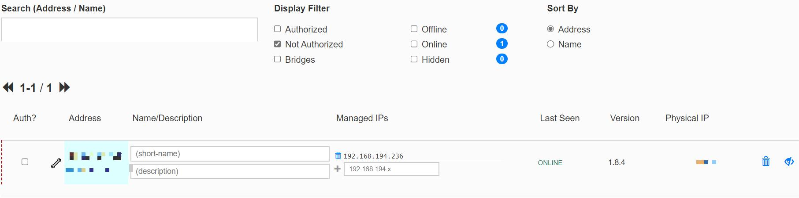
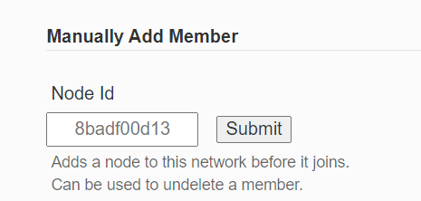

# ZeroTier实现内网穿透
> 作者：rtyu
> 邮箱：liusr19@mails.tsinghua.edu.cn

### ZeroTier简介

Zerotier采用VLAN技术将不同设备连接到一个“虚拟的局域网”中，从而让这些设备随时随地都可以互相访问。

### 内网穿透

内网穿透，也即 NAT 穿透，进行 NAT 穿透是为了使具有某一个特定源 IP 地址和源端口号的数据包不被 NAT 设备屏蔽而正确路由到内网主机。

举例：比如我在寝室配置了一台服务器 Server A，当我在寝室的时候，就可以通过自己的笔记本直接访问该服务器上网络分享的文件。而当我离开寝室以后，就没有办法直接访问服务器了，这个时候就需要进行内网穿透，使得我在寝室之外也可以直接访问该服务器上网络分享的文件。


### ZeroTier使用


#### 登录官网 

https://www.zerotier.com/

#### 创建网络 

登录后，选中导航栏中"Networks"，点击"Create A Network"创建网络。


这是创建出来的网络，记住左侧的network id，之后需要用到。

#### 网络设置 

点击创建完成的网络，出现设置界面


+ Name: 网络名称
+ Description：网络描述
+ Access Control： 
	+ PRIVATE模式：节点成为网络的成员需要经过授权（建议选择该模式）
	+ PUBLIC模式：任何节点均可成为网络的成员，成员不能被取消授权也不能够被删除。但是30天不在线的成员会被自动移除。

其他设置默认即可

#### 客户端安装

[Download – ZeroTier](https://www.zerotier.com/download/)

安装设备对应版本即可。
以windows和Linux为例：

 **Windows**

选择windows下载安装
安装完成后，右键任务栏中zerotier图标，选择打开Control Panel

在下方输入之前记住的网络id，点击加入Network, 即可加入网络。


**Linux**
   安装：

```shell
$ curl -s https://install.zerotier.com | sudo bash
```

安装完成后可以使用 systemctl 命令来控制服务：

```shell
$ sudo systemctl enable zerotier-one.service

$ sudo systemctl start zerotier-one.service

$ sudo zerotier-cli join 17d709436cc4b024
```

查看安装的zerotier版本：

```shell
$ sudo zerotier-cli status
```

加入一个network:

sudo zerotier-cli join  **17d709436cc4b024**（填写自己的 networkid）

退出一个network:

sudo zerotier-cli leave  **17d709436cc4b024**（networkid）

加入网络完成后，回到网络设置界面

此时，未授权节点中出现刚刚加入网络的节点，点击Auth?下方的单选框后授权完成，该节点已成为当前网络的成员。

#### 手动添加节点


输入节点的id（客户端中显示），点击submit，即可将对应节点添加至该网络。

#### 访问

现在你就可以通过该网络分配给各个设备的IP自由访问接入网络中的设备了

### 参考链接

> [用zerotier实现内网穿透 - 知乎 (zhihu.com)](https://zhuanlan.zhihu.com/p/422171986)

