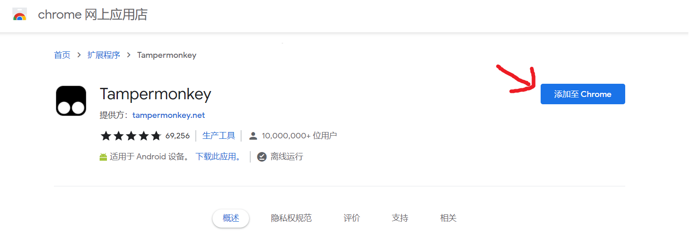
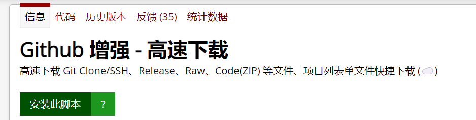
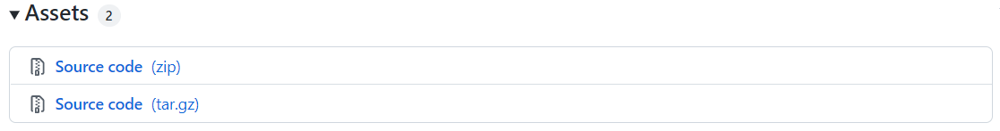
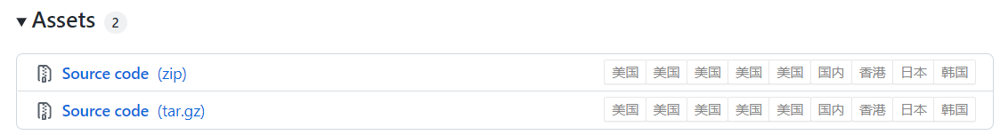
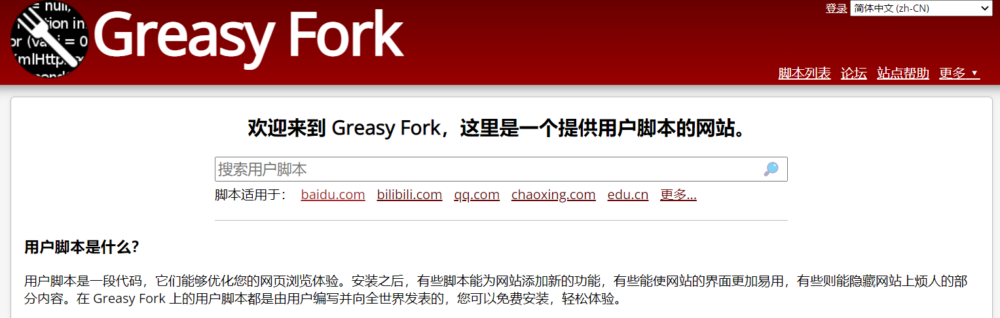
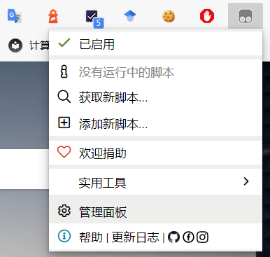
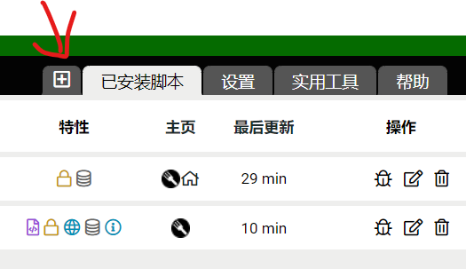

# 油猴脚本

> 作者：和嘉晅
> 微信：h9j123x456
> 邮箱：jx-he19@mails.tsinghua.edu.cn

油猴脚本是一个浏览器上的用户脚本管理器，它允许你通过JavaScript代码自定义你的浏览器使用体验。本篇文章将向您分享油猴脚本的使用方法，包括：

* 安装用户脚本管理器
* 下载并安装热门的用户脚本
* 编写自定义用户脚本：一键获取论文PDF，雨课堂答题提醒。

### 安装用户脚本管理器

打开浏览器的扩展商店，搜索`Tampermonkey`，或者复制链接
[https://chrome.google.com/webstore/detail/tampermonkey/dhdgffkkebhmkfjojejmpbldmpobfkfo](https://chrome.google.com/webstore/detail/tampermonkey/dhdgffkkebhmkfjojejmpbldmpobfkfo)
到浏览器。如下图，点击`添加至Chrome`按钮，即可下载并安装用户脚本管理器。


安装完成后，地址栏右侧会出现灰色的Tampermonkey图标。


### 下载并安装热门的用户脚本

以[Github网络增强脚本](https://greasyfork.org/zh-CN/scripts/412245-github-%E5%A2%9E%E5%BC%BA-%E9%AB%98%E9%80%9F%E4%B8%8B%E8%BD%BD)为例，这个脚本可以提升下载releases中文件的速度。



安装完成后再打开Github，可以发现Releases多出了选择下载服务器。

|                                 |                                |
| ------------------------------- | ------------------------------ |
| BEFORE |  |
| AFTER |  |

可以在[Greasy Fork](https://greasyfork.org/zh-CN)或是[Github](https://gist.github.com/search?l=JavaScript&o=desc&q="%3D%3DUserScript%3D%3D"&s=updated)上下载并安装更多热门的用户脚本，例如[各大网站音乐、视频下载](https://greasyfork.org/zh-CN/scripts/418804-解锁b站大会员番剧-b站视频解析下载-全网vip视频免费破解去广告-全网音乐直接下载-油管-facebook等国外视频解析下载-网盘搜索引擎破解无限下载等)，[豆瓣和IMDb互相显示评分](https://greasyfork.org/zh-CN/scripts/7687-moremovieratings)等。



### 编写自定义用户脚本

除去安装他人完成的脚本外，还可以编写自定义用户脚本。点击地址栏右侧的Tampermonkey扩展图片，在下拉菜单中选择`管理面板`。



在打开的页面中点击加号按钮，可以创建新的用户脚本。



新的用户脚本包含以下JavaScript代码：

```javascript
// ==UserScript==
// @name         New Userscript
// @namespace    http://tampermonkey.net/
// @version      0.1
// @description  try to take over the world!
// @author       You
// @match        https://*
// @icon         https://www.google.com/s2/favicons?sz=64&domain=google.com.hk
// @grant        none
// ==/UserScript==

(function() {
    'use strict';

    // Your code here...
})();
```

这样就创建了一个自定义的用户脚本。

#### 一键获取论文PDF

复制以下代码，替换掉原有代码，并保存：

```javascript
// ==UserScript==
// @name         Download Paper PDF
// @match        https://dl.acm.org/*
// @match        https://www.sciencedirect.com/*
// @match        https://ieeexplore.ieee.org/*
// @run-at       document-idle
// ==/UserScript==

(function() {
    'use strict';

    var scihub_base_url = 'https://sci-hub.ru/'
    var doi_url;
    var doi_node;
    var linkList = document.getElementsByTagName('a'); // all links in the page
    for(var link of linkList)
        if(link.href.startsWith('https://doi.org')) {
            link.href = scihub_base_url + link.href;
            link.style.background = 'yellow'; // change link's background color to yellow
        }
})();
```

其中：

* `@match REGEX_URL`表示这个脚本在网址与正则表达式`REGEX_URL`匹配时加载。可以使用多个`@match`指定脚本在多个网站上运行。
* `@run-at document-idle`指定了脚本的运行时机，`document-idle`意味着脚本将在`DOMContentLoaded`事件触发后开始执行。在大部分情形下直接用`@run-at document-idle`就可以了。
* JavaScript部分的代码：在页面上寻找所有以`https://doi.org`开头的链接，将地址改为Sci-Hub上对应DOI的检索结果，并用黄色背景强调
  * `document.getElementsByTagName('a')`：获取网页中的所有链接
  * `link.href = newURLString`，其中`link`是一个链接元素：改变点击链接元素跳转到的地址
  * `link.style.background = 'yellow'`：将`link`元素的背景改成黄色

其效果如下：


#### 雨课堂答题提醒

以下代码可以在雨课堂网页上推送新的题目时，响铃提醒。

```javascript
// ==UserScript==
// @name         雨课堂答题提醒
// @match        https://*.yuketang.cn/lesson/*
// @run-at       document-idle
// ==/UserScript==

(function() {
    'use strict';

    var audio = new Audio('https://upload.wikimedia.org/wikipedia/commons/3/34/Sound_Effect_-_Door_Bell.ogg');
    var lastProblemCount = -1;
    setInterval(function () {
        var problemCount = document.getElementsByClassName('problem').length;
        console.log(problemCount, lastProblemCount);
        if (lastProblemCount != -1 && lastProblemCount != problemCount){ // new problem!
            audio.play()
        }
        lastProblemCount = problemCount;
    }, 3000);
})();
```

读者可以查阅[文档](https://developer.mozilla.org/zh-CN/docs/Web/API)了解`Audio`，`setInterval`，`Document.getElementsByClassName`，并对代码做出自己的修改。

### 参考链接

> https://www.tampermonkey.net/documentation.php?ext=dhdg&locale=zh
> https://developer.mozilla.org/zh-CN/docs/Web/API

## 下载pdf

[点击下载](MonkeyScript.pdf)
