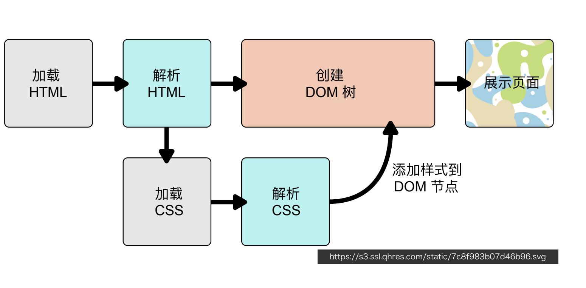

# CSS

作者：陆离马鹿

## 2.1 CSS简介

### 2.1.1 基本功能与结构

> Cascading Style Sheets
> 
- 用来定义页面元素的样式
    - 设置字体和颜色
    - 设置位置和大小
    - 添加动画效果
- 例：选择器

```css
h1{/*h1-选择器Selector*/
	color:white;/*属性Preperty,属性值Value*/
	font-size:14px;/*属性和属性值合在一起为声明Declaration*/
}
/*选择器+声明块->规则*/
```

### 2.1.2 在页面中使用CSS

1. 外链

```html
<link rel="stylesheet" href="/assests/style.css">
```

1. 嵌入

```html
<style>
	li { margin:0; list-style: none;}
	p { margin: lem 0; }
</style>
```

1. 内联

```html
<p style="margin: lem 0"> Example Content</p>
```

### 2.1.3 CSS的工作原理



### 2.1.4 代码风格

- 每个声明一行
- 两条规则之间一条空行

### 2.1.5 调试CSS

- 开发者工具styles工具

## 2.2 基础选择器

### 2.2.1 选择器Selector

- 找出页面中的元素，以便给他们设置样式
- 使用多种方式选择元素
    - 按照标签名、类名或ID
    - 按照属性
    - 按照DOM树中的位置

### 2.2.2 通配选择器

```html
<style>
* {
	color: red;
	font-size:20px;
}
</style>
```

### 2.2.3 标签选择器

```html
<style>
h1 {
	color: orange;
}

p {
	color: gray;
	font-size: 20px;
}
</style>
```

### 2.2.4 ID选择器

```html
<header>
	<h1 id="logo"> HTML 5</h1>
</header>
<style>
	#logo {
		font-size: 60px;
		font-weight: 200;
	}
</style>
```

### 2.2.5 类选择器

```html
<ul>
	<li class="done"> Learn HTML</li>
	<li class="done"> Learn CSS</li>
</ul>
<style>
.done {
		color: gray;
		text-decoration: line-through;
	}
</style>
```

### 2.2.6 属性选择器

```html
<p>
	<label>用户名: </label>
	<input value="zhao" disabled>
</p>

<style>
	input[disabled] {
		background: #eee;
		color: #999;
	}
</style>
```

```html
<style>
	input[type="password"] {
		border-color: red;
		color: red;
	}
</style>
```

### 2.2.7 正则表达式选择

```html
<style>
	a[href^="#"] {<!-- 以#开头的href -->
		color: #f54767;
		background: 0 center/lem
			url(top.svg) no-repeat;
		padding-left: 1.1lem;
	}

	a[href$=".jpg"] {<!-- 以.jpg结尾的href -->
		color: deepskyblue;
		background: 0 center/lem
			url(image.svg) no-repeat;
		padding-left: 1.1lem;
}
</style>
```

### 2.2.8 伪类

- 不基于标签和属性定位元素
- 几种伪类
    - 动态伪类
    - 结构性伪类
1. 动态伪类

```html
<style>
	a:link {
		color:black;
	}

	a:visited {
		color:gray;
	}

	a:active {
		color:red;
	}

	a:hover {
		color:orange;
	}

	:focus {
		outline: 2px solid orange;
	}
</style>
```

1. 结构性伪类

```html
<style>
	li {
		list-style-position:inside;
		boder-bottom:1px solid;
		padding:0.5em
	}
	
	li:first-child {
		color:coral;
	}
	
	li:last-child {
		boder-bottom:none;
	}
</style>
```

### 2.2.9 组合器

将简单选择器组合起来

```html
<style>
	.error {
		color:red;
	}
	
	input.error {<!-- 同时为input类型且class=error -->
		border-color: red;
	}
</style>
```


```css
article p {
}

article > p {
}

article section p {
}
```

### 2.2.10 选择器组

```css
body,h1,h2,h3,h4 {
	margin:0;
	padding:0;
}

[type="checkbox"],[type="radio"] {
	box-sizing: border-box;
	padding:0;
}
```

## 2.3 设置字体

### 2.3.1 设置

```html
<style>
	h1 {
		font-family:Optima,Georgia,serif;
	}
	body {
		font-family:Helvatica,sans-serif;
	}
</style>
```

### 2.3.2 通用字体族

- Serif 衬线体：Geogia、宋体
- Sans-Serif 无衬线体：Arial、Helvetica、黑体、微软雅黑
- Cursive 手写体：Cafisch Script、楷体
- Fantasy：Comic Sans MS、Papyrus
- Monospace 等宽字体：Consolas、Courier、中文字体

> 使用建议：
1. 字体列表最后写上通用字体族
2. 英文字体放在中文字体前面
> 

### 2.3.3 web Fonts

```html
<style>
	@font-face {
		font-family:'Megrim';
		src: url('/megrim.woff2') format('woff2'),
				 url('megrim.ttf') format('truetype')
	}

	@font-face {
		font-family:'Buda';
		src: url('/buda.woff2') format('woff2'),
				 url('/buda.ttf') format('truetype');
	}
	
	h1 {
		font-family: Megrim,Cursive;
		font-size:40px;
	}
```

### 2.3.4 font-size

- 关键字
    - small、medium、large
- 长度
    - px、em（2em-字符大小的2倍）
- 百分数
    - 相对于父元素字体大小

```html
<style>
	section {
		font-size:20px;
	}
	
	section h1 {
		font-size:2em;
	}
	
	section .note {
		font-size:80%;
		color:orange;
	}
	</style>
```

### 2.3.5 font-style

```html
<style>
	.normal {
		font-style: normal;
	}

	.italic {
		font-style:italic
	}
</style>
```

### 2.3.6 font-weight

100~900

normal=400 bold=700

```css
.w1 { font-weight: 100 }
.w2 { font-weight: 200 }
```

### 2.3.7 line-height

```css
h1 {
	font-size:30px;
	line-height:45px;
}
	
p {
	font-size:20px;
	line-height:1.6;/*多倍行高*/
}
```

### 2.3.8 font

> font: style weight size/height family
> 

```css
h1 {
/*斜体 粗细 大小/行高 字体族*/
	font:bold 14px/1.7 Helvetica,sans-serif;
}

p {
	font:14px serif;
}
```

## 2.4 设置文字样式

### 2.4.1 text-align

```css
h1 {
	text-align:left;
}

h2 {
	text-align:center;
}

h3 {
	text-align:right;
}

h4 {
	text-align:justify;
}
```

### 2.4.2 spacing

```css
h1 {
	letter-spacing:1px;
	word-spacing:5px;
}
```

### 2.4.3 text-indent

- 首行缩进

```css
h1 {
	text-indent:10px;
}
```

### 2.4.4 text-decoration

- 文字修饰

```css
h1 {
	text-decoration:none;
}

h2 {
	text-decoration:underline;
}

h3 {
	text-decoration:line-through;
}

h4 {
	text-decoration:overline;
}
```

### 2.4.5 white-space

```css
h1 {
	white-sapce:normal;/*默认值,自动处理换行*/
}

h2 {
	white-sapce:nowrap;/*强制不换行,直到文本结束或者遇到br对象*/
}

h3 {
	white-sapce:pre;/*用等宽字体显示预先格式化的文本*/
/*不合并字间的空白距离和进行两端对齐,换行和其他空白字符都将受到保护*/
}

h4 {
	white-sapce:pre-wrap;/*保留空白符序列,但是正常地进行换行*/
}

h5 {
	white-sapce:pre-line;/*合并空白符序列,但是保留换行符*/
}

h6 {
	white-sapce:inherit;
}
```

### 2.4.6 text-shadow

- text-shadow: color offset-x offset-y blur-radius
- 或text-shadow: offset-x offset-y blur-radius color

```css
h6 {
	text-shadow: blue 2px 2px 1px
}
```

## 2.5 盒模型基础


### 2.5.1 width

- 指定content box宽度
- 取值为长度、百分数、auto
- auto由浏览器根据其他属性确定
- 百分数相对于容器的content box宽度

### 2.5.2 height

- 指定content box高度
- 取值为长度、百分数、auto
- auto取值由内容计算而来
- 百分数相对于容器的content box高度
- 容器有指定的高度时，百分数才生效

### 2.5.3 padding 内边距

- 指定元素四个方向的内边距
- 百分数相对于容器宽度
1. 10px 四周
2. 10px 20px 前一个为上下，后一个为左右
3. 10px 20px 10px 20px

### 2.5.4 border

- 指定容器边框样式、粗细和颜色
- 三种属性
    - border-width
    - border-style: solid或dotted
    - border-color
    - 使用border属性统一设置 border: width style color
- 四个方向
    - border-top
    - border-right
    - border-bottom
    - border-left

### 2.5.5 margin

- 指定元素四个方向的外边距
- 取值可以是长度、百分数、auto
- 百分数相对于容器宽度

> Margin collapse
垂直方向上margin会合并
> 
- 允许有负margin

### 2.5.6 box-sizing: border-box

content-box

border-box

### 2.5.7 overflow

控制内容有溢出时候的行为

```css
/*visible
hidden
scroll
*/
```

### 2.5.8 min-width & max-width & max-height & max-width

## 2.6 CSS中的盒子

### 2.6.1 DOM树与盒子

- 根据DOM树生成盒子
- 摆放盒子（Layout）
    - 盒子尺寸和类型
    - 定位模式（positioning scheme）
    - 节点在DOM树中的位置
    - 其他信息（窗口大小、图片大小等）

### 2.6.2 不同的盒子

块级盒子以及行级盒子


### 2.6.3 display

1. block 块级盒子
2. inline 行级盒子
3. inline-block 本身是行级，可以放在行盒中；可以设置宽高；作为一个整体不会被拆散成多行
4. none 排版时完全被忽略

## 2.7 盒子的效果

### 2.7.1 圆角border-radius

- 1个值、2个值、4个值：分别表示4个角
- A/B 表示水平与垂直的圆角大小
- 使用百分比表示圆角大小占长/宽的比

### 2.7.2 background

- background-color 默认值为透明transparent
- background-image: url(/azis.png)
- background-repeat: repeat/no-repeat/repeat-x/repeat-y 背景图是否重复
- background-position: x y 背景图的位置，x,y为左上角的值
    - top/left/right/center/bottom
    - top left/top right/bottom left/bottom right
    - len-x len-y
    - percent-x percent-y 原图片的百分比
    - bottom len_1 right len_2 相对于边缘的偏移量
- bakcground-size 背景图大小
    - length.x length.y 能单独使用auto
    - percentage 相对于背景区域的百分比，有x,y两个方向的值，能单独使用auto
    - cover 保持纵横比并将其所方程完全覆盖背景区域的最小大小
    - contain 保持图像的纵横比并将图像所方程适合背景区域的最大大小

### 2.7.3 background-clip

背景图的覆盖范围

- bcakground-clip: border-box
- bcakground-clip: padding-box
- bcakground-clip: content-box

### 2.7.4 background属性

```css
.box{
	background: padding-box red url(/cat.png) no-repeat top center / 100px 100px
}
```

### 2.7.5 box-shadow

```css
box-shadow: 水平偏移量 垂直偏移量 模糊程度 扩张大小 颜色
box-shadow: 10px 10px 10px 0 gray
```

使用逗号隔开就能设置多重阴影

## 2.8 行高和垂直对齐


### 2.8.1 行级盒子的高度


### 2.8.2 vertical-align

```css
vertical-align:baseline
vertical-align:middle
vertical-align:top
vertical-align:bottom
vertical-align:text-top
vertical-align:text-bottom
vertical-align:0px/*baseline往上的偏移*/
```

## 2.9 CSS继承

### 2.9.1 选择器的特异度Specificity

计算元素个数，如下图中分别为122与22


### 2.9.2 属性覆盖

高优先级的会覆盖低优先级的

### 2.9.3 继承

某些属性会自动继承其父元素的计算值，除非显示指定一个值

```html
<p>
	This is a
	<em>test</em>
	of
	<strong>inherit</strong>
</p>

<style>
	body {
		font-size:20px;
	}

	p {
		color: blue;
	}

	em {
		color:red;
	}
</style>
```

### 2.9.4 显式继承

```css
* {
	box-sizing:inherit;
}
	
html {
	box-sizing:boder-box;
}

.some-widget {
	box-sizing:content-box
}
```

### 2.9.5 初始值

- CSS中，每个属性都有一个初始值
- 可以使用initial关键字显式重置为初始值
    - background-color:initial

## 2.10 CSS中的值和单位

### 2.10.1 CSS中的值


### 2.10.2 长度


### 2.10.3 其他

1. 颜色
**RGB**： #RRGGBB/rgb(r,g,b)
HSL[色相Hue，饱和度Saturation，亮度Lightness]：hsl(h,s,l)
2. alpha 透明度
0完全透明，1完全不透明
**RGBA**： #RRGGBBAA，rgba(r,g,b,a)，hsla(h,s,l,a)
3. 时间
ms，s

# 3 CSS布局

## 3.1 CSS布局概述

### 3.1.1 布局相关技术

1. 常规流Normal Flow
    - 根元素、浮动和绝对定位的元素会脱离常规流
    - 其他元素都在常规流之内（in-flow）
    - 常规流中的盒子，在某种排版上下文中参与布局
        - 行级排版上下文（Inline Formatting Context, IFC）
            - 只包含行级盒子的容器会创建一个IFC
            - IFC内的排版规则
                - 盒子在一行内水平摆放
                - 一行放不下时换行显示
                - text-align决定一行内盒子的水平对齐
                - vertical-align决定一个盒子在行内的垂直对齐
                - 避开浮动（float）元素
                
                > overflow-wrap:break word 单词内可换行
                > 
        - 块级排版上下文（Block Formatting Context, BFC）
            - 某些容器会创建一个BFC
                - 根元素
                - 浮动、绝对定位、inline-block
                - Flex子项和Grid子项
                - overflow值不是visible的块盒
            - BFC内的排版规则
                - 盒子从上到下摆放
                - 垂直margin合并
                - BFC内盒子的margin不会与外面的合并
                - BFC不会和浮动元素重叠
                - 有时产生匿名的块级盒子
        - Table排版上下文
        - Flex排版上下文
        - Grid排版上下文
2. 浮动
3. 绝对定位

## 3.2 Flexible Box I

> 一种新的排版上下文
> 
- 它可以控制子级盒子的：
    - 摆放的流向（$\leftarrow,\rightarrow,\uparrow,\downarrow$）
    - 摆放顺序
    - 盒子宽度和高度
    - 水平和垂直方向的对其
    - 是否允许折行

```css
display:flex /*使元素生成一个块级的Flex容器*/
display:inline-flex/*使元素生成一个行级的FLex容器*/
```

### 3.2.1 流向与换行

```css
flex-direction:row/*flex-direction控制排版内的流向*/
flex-direction:row-reverse
flex-direction:column
flex-direction:column-reverse
```

```css
flex-wrap:nowrap/*flex-wrap控制是否换行,默认值为nowrap*/
flex-wrap:wrap/*允许换行*/
```

### 3.2.2 Flexibility

- 可以设置子项的弹性：当容器有剩余空间时，会伸展；容器空间不够时，会收缩。
    - flex-grow 有剩余空间时的伸展能力
    - flex-shrink 容器空间不足时收缩的能力
    - flex-basis 没有伸展或收缩时的基础长度

```css
flex-grow:0/*默认值为0*/
flex-grow:1/*伸展能力是相对的*/
```

```css
flex-shrink:0/*默认值为1,即默认能够收缩,为0则不能收缩*/
```

```css
flex-basis:50%/*没有伸展也没有收缩时的大小,优先级比width高*/
flex-basis:content/*默认值*/
```

- flex属性

```css
flex:grow shrink basis
```

## 3.3 Flexible Box II

### 3.3.1 justify-content 主轴方向对齐

```css
justify-content:flex-start;
justify-content:flex-end;
justify-content:center;
justify-content:space-between;
justify-content:space-around;
justify-content:space-evenly;
```

### 3.3.2 align-items 侧轴方向对齐

```css
align-items:flex-start;
align-items:flex-end;
align-items:center;
align-items:stretch;/*拉伸至与父容器同高,为默认值*/
align-items:baseline;/*文字基线对齐*/
```

### 3.3.3 align-self 子元素对齐方式

```css
align-self:flex-start;
align-self:flex-end;
align-self:center;
align-self:stretch;
align-self:baseline;
```

### 3.3.4 align-content 多行在侧轴方向对齐

```css
align-content:flex-start;
align-content:flex-end;
align-content:space-between;
align-content:stretch;
align-content:space-around;
```

### 3.3.5 order 顺序

- 默认值为0
- 按照order从小到大的顺序来排列

```css
order:-1;
order:1;
order:2;
```

## 3.4 Grid布局 I

- flex-box是一维单向的布局方式
- grid是二维的布局方式

### 3.4.1 display:grid

- 使元素生成一个块级的Grid容器
- 使用grid-template相关属性将容器划分为网格
- 设置每一个子项占哪些行
- 划分网格
  
    ```css
    grid-template-columns:100px 100px 200px;/*横向分为100,100,200*/
    grid-template-rows:100px 100px;/*纵向分为100,100*/
    
    grid-template-columns:30% 30% auto;
    grid-template-rows:100px auto
    
    grid-template-columns:100px 1fr 1fr;/*fraction 份数,平分剩下的份数*/
    grid-template-rows:100px 1fr;
    ```
    

### 3.4.2 Grid line网格线, Grid area网格区域


```css
.a {
	grid-row-start:1;
	grid-column-start:1;
	grid-row-end:3;
	grid-column-end:3;
}
```

```css
.a {
	grid-area:1/1/3/3;
}
```

- 命名网格线：在指定行列宽高时命名

```css
.preview {
	grid-template-columns:
		[left] 100px [center] 1fr [right]
	grid-template-rows:
		[top]
		1fr
		[middle]
		1fr
		[bottom]
}

.a {
	grid-area: top/left/bottom/center;
}
```

- 命名网格区域：使用grid-template-areas命名

```css
.preview {
	display:grid;
	grid-template-columns:200px 1fr;
	grid-template-rows:50px
										 1fr
										 50px;
	grid-template-areas:"header header"
											"aside main"
											"footer footer";
}

.a {
	grid-area:header;
}
```

## 3.5 Grid布局 II

### 3.5.1 grid-gap

```css
grid-row-gap:10px;/*行间距*/
grid-column-gap:20px;/*列间距*/
```

```css
grid-gap:10px 20px;/*行与列一起指定*/
```

```css
grid-gap:20px;
```

### 3.5.2 justify-items 行方向对齐

```css
justify-items:stretch;/*默认为伸展*/
justify-items:start;
justify-items:end;
justify-items:center;
```

### 3.5.3 align-items 列方向对齐

```css
align-items:stretch;/*默认为伸展*/
align-items:start;
align-items:end;
align-items:center;
```

### 3.5.4 align-self/justify-self

控制元素在块内的对齐方式

```css
.a {
	align-self:center;
	justify-self:center;
}
```

### 3.5.5 align-content/justify-content

Grid块没有占满全部区域时使用align-content/justify-content

```css
.preview {
	grid-template-rows:100px 100px;
	grid-template-columns:100px 100px 100px;
}

justify-content:center;
align-content:center;

justify-content:end;
align-content:end;

justify-content:space-between;
align-content:space-between;

justify-content:space-around;
align-content:space-around;
```

## 3.6 表格样式

### 3.6.1 宽度设置

```css
table th {
	width 100px;
}

table th,
table td {
	width 100px;
}

table {
	width:200px;
	table-layout:fixed;
}

table th {
	width: 100px;
}
```

### 3.6.2 边框设置

```css
table {
	border: 1px solid red;
}
```

### 3.6.3 display:table 表格

```html
<nav>
	<a href="#">Home</a>
	<a href="#">Blog</a>
</nav>
```

```css
nav {
	display:table;
	width:100%;
	background:lightblue;
}

nav a {
	display:table-cell;
	text-align:center;
}
```


## 3.7 浮动

### 3.7.1 浮动

- 浮动对布局的影响
    - 浮动元素脱离常规流，漂浮在容器左边或右边
    - 浮动元素贴着容器边缘或另外的浮动元素
    - 浮动元素不会影响常规流里面的块级盒子
    - 浮动元素后面的行盒会变短以避开浮动元素

```css
/*left,right,none,默认为none*/
img {
	float:left;
}
```

- clear

```css
 .section_2 {/*不会环绕图片*/
	clear:left;/*left,right,both,none*/
}
```

- 将浮动的影响控制在容器内：不会与浮动元素重叠
    - Block Formatting Context
        - BFC的高度包含浮动元素
        - BFC不会和浮动元素上下重叠
    - 创建BFC
        - overflow非visible
        - float、inline-block、绝对定位

## 3.8 定位

### 3.8.1 position属性

- position:relative
    - 在常规流里面布局
    - 相对于自己本应该在的位置进行偏移
    - 使用top, left, bottom, right设置偏移长度，如top:20px, top:50%
    - 流内其他元素当它没有偏移一样布局
    
    ```css
    img {
    	positon:relative;
    	top:20px;
    	left:10px;
    }
    ```
    
- position:absolute
    - 脱离常规流
    - 相对于最近的非static祖先定位
    - 不会对流内元素布局造成影响
    - 使用top, left, bottom, right设置偏移长度，如top:20px, top:50%
    - 不设置top, left则默认在左上角（0位置）
- position:fixed
    - 相对于Viewport定位
    - 不会随页面滚动发生位置变化

## 3.9 堆叠层级

### 3.9.1 z-index

- 为定位元素指定其在z轴的上下层级
- 用一个整数表示，数值越大，越靠近用户
- 初始值为auto，可以为负数、0、正数

### 3.9.2 堆叠上下文

> 一个堆叠上下文的元素才能相比较
若不同则看上下文的层级
> 

### 3.9.3 绘制顺序

- 在每一个堆叠上下文中，从下到上：
    - 形成该上下文的元素的border和background
    - z-index为负值的子堆叠上下文
    - 常规流内的块级元素
    - 浮动元素
    - 常规流内行级元素
    - z-index为0的子元素或子堆叠上下文
    - z-index为正数的子堆叠上下文

# 4 CSS高级

## 4.1 CSS Transform

### 4.1.1 transform 变形

- 对元素进行平移、旋转、缩放、倾斜
    - translate
    - rotate
    - scale
    - skew
- transform不会对其他元素布局产生影响
1. translate

```css
.emoji {/*向右下角平移*/
	transform:translate(100px,100px)
}

.emoji {
	transform:translateX(100px);
}

.emoji {
	transform:translateY(-1em);
}

.emoji {
	transform:translate(100%,100%);
}
```

1. rotate

```css
.emoji {/*顺时针旋转*/
	transform:rotate(90deg);
}

.emoji {
	transform:rotate(0.5turn);
}

.emoji {
	transform-origin:0 0;
	transform:rotate(-50deg);
}

.emoji {
	transform-origin:0 0;
	transform:rotate(360deg);
}
```

1. Scale

```css
.emoji {
	transform:scale(2);
}

.emoji {
	transform:scale(3,0.5);/*横纵方向的scale*/
}

.emoji {
	transform-origin:0 0;/*指定基准位置*/
	transform:scale(4);
}

.emoji {
	transform-origin:0 0;
	transform:scaleY(2);/*可以使用scaleX,scaleY分别对两个方向做出改变*/
}
```

1. skew 扭曲

```css
.emoji {/*旋转,有x,y参数*/
/*在x,y方向分别倾斜*/
	transform:skew(30deg)
}

.emoji {
	transform:skewY(50deg);
}

.emoji {
	transform:skew(30deg,20deg);
}
```

1. perspective 视角

```css
.emoji {
	transform:perspective(100px);/*人眼距离屏幕100px*/
	rotateY(40deg);/*绕y轴转,为3d效果*/
}
```

1. translate3d 在3d空间中的平移，多了z轴的偏移量

```css
.emoji {/*perspecctive视角,小则广角*/
	transform:perspective(100px);
						translate3d(100px,100px,20px);
						rotateY(80px);
}
```

1. 多次操作

```css
.emoji {
	transform:translateX(100px)
						rotate(90deg)
}

.emoji {
	transform:rotate(90deg)
						translateX(100px)
}
/*两种结果不同,原因为每个操作均以元素自身的坐标轴做标准*/
```

## 4.2 CSS Transition

### 4.2.1 transition 过渡

- 指定从一个状态到另一个状态时如何过渡
- 动画的意义：告诉用户发生了什么
- transition属性：
    - transition-property 哪个属性需要过渡
    - transition-duration 过渡时间
    - transition-timing-function
    - transition-delay

```html
<div class="box"></div>
```

```css
.box {
    height: 200px;
    background: coral;
    transition-property: height;
    transition-duration: 1s;
    transition-timing-function: linear;
}

.box:hover {/*hover为鼠标悬停时动画效果*/
    height: 400px;
}
```

- 也可以将几个参数集中书写

```css
.box {
    height: 200px;
    background: coral;
    transition: all 1s linear;
}

.box:hover {
    height: 400px;
    background: green;
}
```

### 4.2.2 transition-delay

```css
.box {
    height: 200px;
    background: coral;
    transition: height 1s linear, background 2s linear 1s;
		/*最后一个参数为delay时间*/
}

.box:hover {
    height: 400px;
    background: green;
}
```

### 4.2.3 transition-timing-function

1. linear
2. ease
3. ease-in
4. ease-out
5. ease-in-out
6. steps(4) 

> steps(k)
> 

## 4.3 CSS Animation

### 4.3.1 animation

- 可以实现更复杂的样式变化效果
- 使用方法
    - 定义关键帧样式
    - 应用动画到元素上

```css
@keyframes down {
  from {
      margin-top: 0;
      opacity: 1;
  }

  50% {
      margin-top: 0.5em;
      opacity: 0.3;
  }

  to {
      margin-top: 0;
      opacity: 1;
  }
}
	
.scroll-down {
  position: fixed;
  top: 50%;
  left: 50%;
  transform: translate(-50%, -50%);
  font: normal normal 100px/1 Helvetica;
  color: #f66;
  animation: down 1s ease infinite;
	animation:normal;/*reverse,alternate 逆转,循环*/
}
```

### 4.3.2 animation属性

1. animation-name
2. animation-duration
3. animation-timing-function
4. animation-delay
5. animation-iteration-count
6. animation-direction 表示正序/倒序/其他顺序播放

## 4.4 响应式设计

> 响应式设计：同一个页面可以适应不同屏幕大小设备的设计方案
> 
- 设置viewport
  
    ```html
    <meta name="viewport" content="width=device-width,initial-scale=1.0">
    ```
    
- 图片尺寸设置
    - 背景图片
        - background-size:cover
        - background-size:contain
- media query
    - 针对不同的屏幕尺寸，应用不同的样式
    
    ```css
    @media screen and (min-width:480px) {
    	.box {
    		font-size:16px;
    	}
    }
    ```
    
    - 可以查询的media
        - width/height
        - device-width/device-height
        - device-pixel-ratio
        - orientation
    - 使用不同尺寸的图片
      
        ```html
        `
        ```
        
    - 2rem 2倍根元素中font-size大小

## 4.5 处理CSS兼容性

### 4.5.1 了解浏览器支持情况

### 4.5.2 不同浏览器使用不同的样式

- 层叠cascading

> 浏览器hack原理-层叠
同一个属性，后面书写的值覆盖前面书写的值，对浏览器无效段的属性或属性值会被忽略
> 
- 条件注释

> 浏览器hack原理-条件注释
> 

```html
<!—[if IE 7]> 
	<p>只能在IE7下看得到</p>
<![endif]—>
```

- 浏览器怪癖

> 浏览器hack原理：浏览器怪癖
> 

```css
.container {
	height:100px;
	height:200px\9; /*IE6-9*/
	*height:300px; /*IE 6,7*/
	_height:400px;/*IE 6*/
}
```

- 浏览器前缀
    - Chrome/SafariW:-webkit-
    - Microsoft:-ms-
    - Mozilla:-moz-
    
    ```jsx
    .example {
    	-webkit-transform:translate(100px,0);
    	-ms-transform:translate(100px,0);
    	transfor:translate(100px,0);
    }
    ```