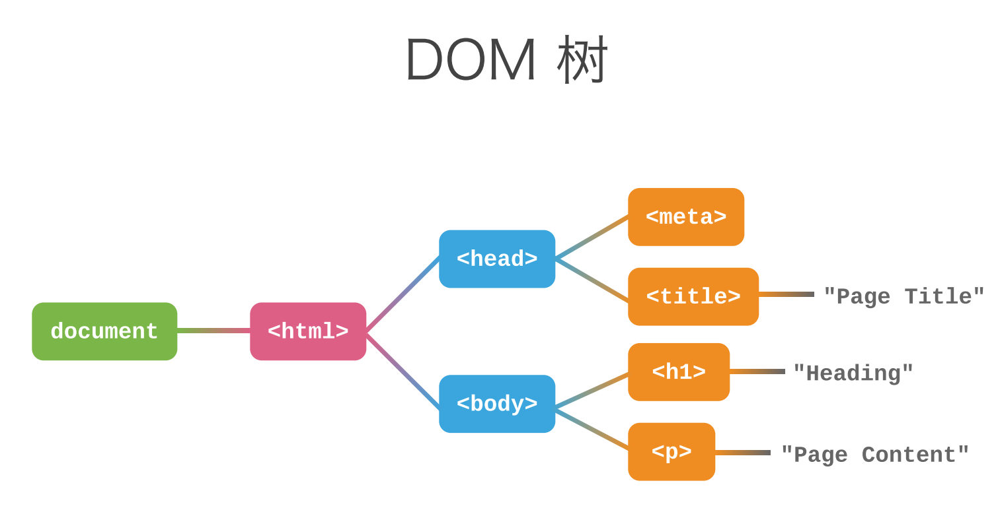

# HTML

作者：陆离马鹿

## 1.1 基本语法

使用**标签**

```html
<h1> Hello World </h1>
```

```html
<!doctype html> <!-- HTML 版本和渲染模式 -->
<html> <!-- 根标签 -->
	<head> <!-- 元数据 -->
		<meta charset="UTF-8">
		<title> 页面标题 </title>
	</head>
	<body> <!-- 包含页面内容 -->
		<h1> 一级标题 </h1>
		<p> 段落内容 </p>
	</body>
</html>
```



属性值使用双引号包裹

空标签可以不闭合

某些属性值可以省略

标签和属性不区分大小写

## 1.2 HTML标签分类

1. Flow 流式元素
2. Metadata 元数据元素
3. Heading 标题内容
4. Sectioning 章节内容
5.  Phrasing 段落内容 
6. Embeded 嵌入式内容
7. Interactive 可交互内容

### 1.2.1 文本类标签

1.  a- 链接

```html
<a href="https://www.w3.org"> w3c </a>
```

**URL** 

Scheme(http://)+Host(www.example.com)+Path(/post/2020/example.html)+Query(?print=1&color=no)+Hash(#heading)

**省略**

省略URL中某一部分时，会自动根据当前页面的URL进行补全

**相对路径与绝对路径**

相对路径为相对于目前页面的路径

**Hash**

```html
<a href=”#product”> 我们的产品 </a>
<h2 id="product"> 我们的产品 </h2> <!-- #product起到锚点的作用 -->
```

**Target-链接目标**

```html
<a href="https://www.w3.org" target="_self"> 当前窗口打开 </a>
<a href="https://www.w3.org" target="_blank"> 新窗口打开 </a>
```

1. 引用
- blockquote 长引用
- q 短引用
- cite 引用来源（书、影视、页面）

```html
<blockquote cite="https://t.cn/RfjKO0F">
	<p> 天才并不是自生自长在深林荒野里的怪物</p>
</blockquote> 
<cite> 鲁迅《未有天才之前》</cite>

<p><cite>维基百科</cite>上说JavaScropt<q>最初命名为Mocha</q></p>
<!-- cite中的在网页中未斜体 q中的为带双引号的内容-->
```

1. 强调
- em 强调重读
- strong 强调重要性

```html
<p> 猫是可爱的动物</p>
<p> 猫<em>是</em>可爱的动物</p> <!-- 斜体 -->
<p> 
	用法和用量：每日三次，每次一片，饭后服用。
	<strong> 警告：孕妇和儿童请遵医嘱。</strong> <!-- 黑体 -->
</p>
```

1. 代码
- code 代码段
- var 变量名
- samp 输出示例
- kbd 键盘操作
1. 空白符

空格会自动合并

```html
<pre>hello
world! </pre> <!-- 预格式化标签 -->
```

1. Entity-实体字符
- &nbsp; 空格
- &lt; <
- &gt; >
- &amp; &
- 最好带上分号

### 1.2.2 多媒体类标签

1. 图片

```html

<!-- alt为必要属性，图片为加载出来时则显示alt的值-->
```

不同格式的图片

jpg 照片，色彩丰富

png 颜色少，支持透明度

webp 体积更小，兼容性一般

gif 动画，体积大

1. 视频

```html
 <video src="/url.mp4" controls autoplay muted loop> </video>
```

视频格式

ogg

webm

mp4

可以同时引入多个source，浏览器选择支持的格式进行播放

```html
<video controls>
	<source src="/bunny.mp4" type="video/mp4">
	<source src="/bunny.ogv" type="video/ogg">
	<source src="/bunny.webm" type="video/webm">
	<p>您的浏览器不支持视频播放</p>
</video>
```

video的其他属性

```html
<video src="/url.mp4"
	poster="/photo.jpg" 
	width="720" height="480"
	preload> </video> 
<!-- poster为未加载出时的显示画面,preload预加载-->
```

给视频添加字幕

```html
<video src="/url.mp4" controls>
	<track kind="subtitles" srclang="zh" src="/subtitle.vtt">
</video>
```

1. audio-音频

```html
<audio src="/sound.mp3" controls> </audio>
```

## 1.3 组织页面内容

header：头部的信息，介绍性、引导性的内容，如：logo，导航链接等

main：页面的主体内容

aside：侧边栏

footer：页面、区块的地步，放参考链接，版权信息等

1. h1-h6
2. article&section

```html
<article>
	<section>
		Azis
	</section>
	<section>
		Vacil
	</section>
</article>
```

1. 列表
- 有序列表

```html
<ol start="1">
	<li> 奥利安费</li>
	<li> 泰坦尼克</li>
</ol>
```

- 无序列表

```html
<ul>
	<li> 1</li>
	<li> 2</li>
</ul>
```

列表可以嵌套

- 定义列表

```html
<dl>
	<dt> 导演：</dt>
	<dd> 陈凯歌</dd>
	<dt> 主演：</dt>
	<dd> 张国荣</dd>
	<dd> 张丰毅</dd>
</dl>
```

1. 导航

```html
<header>
	<nav> 
		<ul>
			<li><a href="www.baidu.com"> Bai</a></li>
			<li><a href="www.baidu.com"> Du</a></li>
		</ul>
	</nav>
</header>
```

## 1.4 HTML表格

```html
<table> 
	<thead><!-- 表头 -->
		<tr>
			<th>客户ID</th>
			<th>客户名称</th>
			<th>所属城市</th>
			<th>账户余额</th>
		</tr>
	</thead>
	<tbody>
		<tr>
			<td>123</td>
			<td>客户A</td>
			<td>北京</td>
			<td>6498.91</td>
		</tr>
		<tr>
			<td>124</td>
			<td>客户B</td>
			<td>上海</td>
			<td>1145.14</td>
		</tr>
	</tbody>
</table>
```

复杂表格-rowspan\colspan

```html
<table>
	<caption>分类</caption> <!-- 表格标题 -->
	<thead>
    <tr>
      <th>分类</th>
      <th>技能</th>
      <th>分数</th>
    </tr>
  </thead>
  <tbody>
    <tr>
      <td rowspan="3">编程语言</td>
      <td>JavaScript</td>
      <td>8</td>
    </tr>
    <tr>
      <td>C++</td>
      <td>7</td>
    </tr>
    <tr>
      <td>Swift</td>
      <td>9</td>
    </tr>
  </tbody>
	<tfoot>
		<tr>
			<td colspan="3">汇总</td>
			<td>114</td>
	</tfoot>
</table>
```

## 1.5 表单

1.5.1 输入框

```html
<form>
	<p>
		<label>用户名</label>
		<input type="text" placeholder="3-12个字符"><!-- 输入类型以及占位符,type默认值为text -->
	</p>
	<p>
		<label>密码:</label>
		<input type="passward">
	<p>
		<label>年龄：</label>
		<input type="number" value="20"><!-- number型具有初值 -->
	</p>
	<p>
		<label>头像:</label>
		<input type="file">
	</p>
	<p>
		<label>生日:</label>
		<input type="date">
</form>
```

1.5.2 多行文本框

```html
<textarea rows="5" cols="30">默认值</textarea>
```

1.5.3 单选框

```html
<form>
	<p>请选择您最喜欢的水果</p>
	<input type="radio" name="fruit"><label>香蕉</label>
	<input type="radio" name="fruit"><label>猕猴桃</label>
	<input type="radio" name="fruit"><label>葡萄</label>
	
	<p>请选择您的衣服尺码</p><!-- 都放在label里面,则点击文字也可以选择了 -->
	<label><input type="radio" name="size">M</label>
	<label><input type="radio" name="size">L</label>
	<!-- 另一种方式,将label与input关联 -->
	<input type="radio" name="size" id="xl"><label for="xl">XL</label>\
</form>
```

1.5.4 复选框

```html
 <form>
	<p>请选择您最喜欢的水果</p>
	<input type="checkbox" checked><label>香蕉</label><!-- checked为预选 -->
	<input type="checkbox" ><label>猕猴桃</label>
	<input type="checkbox" ><label>葡萄</label>
</form>
```

1.5.5 更多类型

1. search
2. tel
3. url
4. email
5. month
6. time
7. range
8. color

1.5.6 下拉选择框

```html
<select name="fruit">
	<option value="1" selected>苹果</option>
	<option value="2">香蕉</option>
	<option value="3">芒果</option>
</select>
```

1.5.7 按钮

```html
<form>
	<p>
		<label>用户名:</label>
		<input name="username">
	</p>
	<p>
		<label>密码:</label>
		<input name="password">
	</p>
	<button type="submit">提交按钮</button>
	<button type="button">普通按钮</button>
</form>
```

## 1.6 HTML语义化

- 代码可读性
- 可维护性
- 搜索引擎优化
- 提升无障碍性
- 传达内容，而不是样式

## 1.7 案例

- header(包含导航栏nav)
- main(包含article)
- aside
- footer

在article\section中也可以使用footer

## 1.8 HTML的可扩展性

1.8.1 自定义属性

通常以”data-”开头

```html
<ul>
	<li data-id="1">苹果</li>
</ul>
```

1.8.2 Meta

1. 页面编码
2. 指定HTTP Header
3. SEO 搜索引擎优化-页面关键词及页面介绍
4. 移动设备Viewport
5. 是否关闭IOS电话号码自动识别
6. 指定内核
7. 指定IE渲染模式

1.8.3 Link

1. 引入CSS样式
2. 指定页面图标
3. 提供RSS
4. 预先加载资源

1.8.4 Microdata

```html
<dt itemprop="name">
<dd itemscope itemptype="Person">
```

嵌入格式化数据，通常由搜索引擎等读取

## 1.9 深入学习HTML

1.9.1 嵌套规则

```html
<p>This is a<div>test</div>.</p>
<!-- 解析为: -->
<p>This is a</p>
<div>test</div>
.
<p></p>
<!-- 因为div不能出现在p里面 -->
```

[HTML, The living standard (traveldevel.org)](https://www.traveldevel.org/books/index.html)